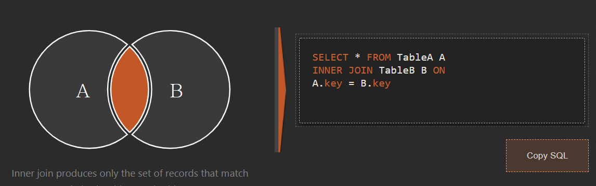

# JOIN

- JOIN 이란?
- LEFT JOIN 
- INNER JOIN

 

## JOIN 이란?

여러 개의 표로 분산된 정보를 결합해서 하나의 단일한 표로 만드는 기술

 

## LEFT JOIN 

가장 많이 사용된다. 

 

## INNER JOIN

A 표와 B 표 모두에 존재하는 정보만으로 새로운 표를 만들 때 사용한다.

 

[SQL Joins Visualizer](https://sql-joins.leopard.in.ua/)