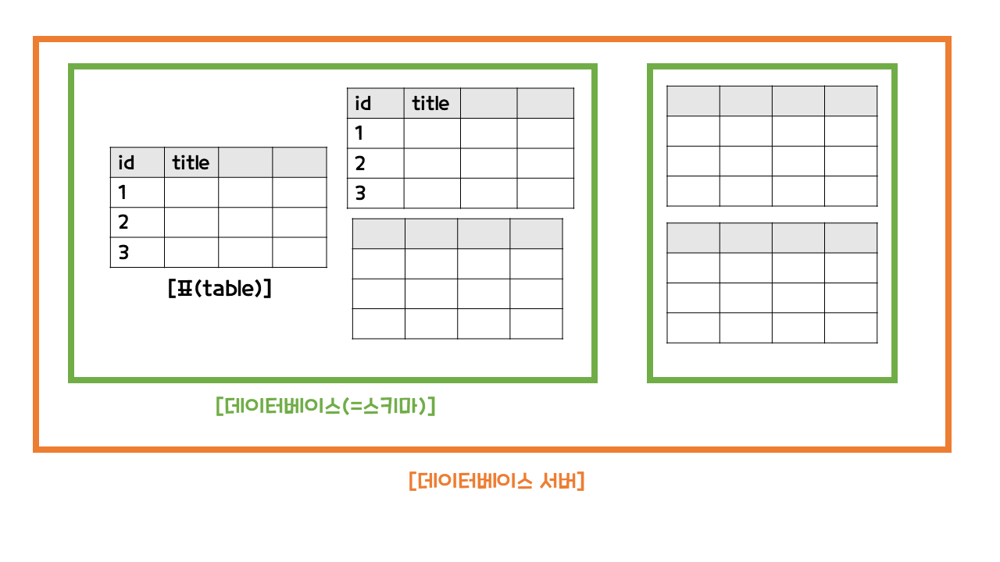

# MySQL

MySQL은 관계형 데이터 베이스이다. 

 

관계형 데이터베이스는 정보가 표(table)에 저장이 된다. 데이터베이스는 스키마라고도 부르며, 연관된 표들을 그루핑해서 연관되어 있지 않은 표들과 분리해준다. 그리고 여러 개의 데이터베이스가 모여서 데이터베이스 서버라고 한다. 

MySQL 설치한 것을 데이터베이스 서버를 설치한 것과 같다.

