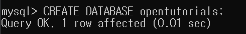

# MySQL 사용하기

- 서버 접속
- 데이터베이스 생성
- 표 생성

<br>

## ✅ 서버 접속

MySQL을 사용하려면 MySQL 서버에 접속하는 것을 제일 먼저 해야 한다.

<br>

```shell
mysql -uroot -p
```

위의 방법으로 MySQL 서버에 접속한다.

- -u[사용자] : root 사용자는 모든 권한이 있다.

<br>

## ✅ 데이터베이스 생성 (스키마 생성)

### 방법

```shell
CREATE DATABASE [데이터베이스 이름];
```

<br>

### 예시

```shell
 CREATE DATABASE opentutorials;
```



<br>

## ✅ 데이터베이스 사용 

데이터베이스를 사용하려면 MySQL에 사용하겠다고 알려줘야 한다.

```
USE opentutorials;
```

위의 명령문을 실행하면 MySQL은 지금부터 내가 쓰는 명령문을 opentutorials라는 스키마에 있는 표를 대상으로 명령을 실행하게 된다.
