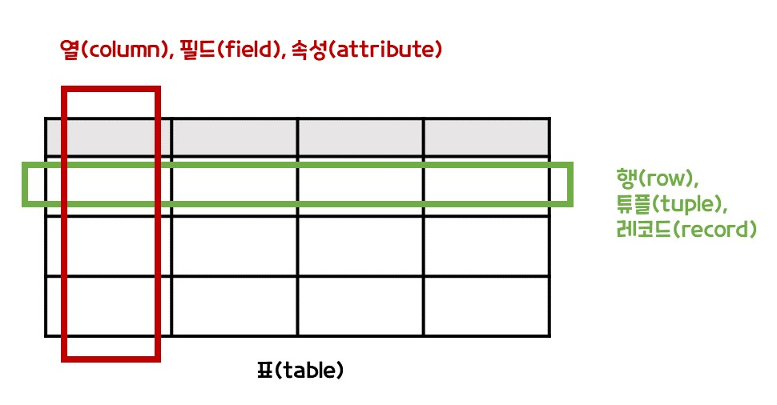

# 관계형 데이터베이스(Relational Database)

- 관계형 데이터베이스
- 테이블 구조

 

## ✅ 관계형 데이터베이스란?

관계형 데이터베이스는 데이터를 테이블에 직관적이고 간단하게 표현한다. 데이터의 중복은 줄이고 유지 보수는 쉽게 할 수 있다.

 

## ✅ 테이블 구조

- 열 : 데이터의 타입, 데이터의 구조
- 행 : 데이터 하나
