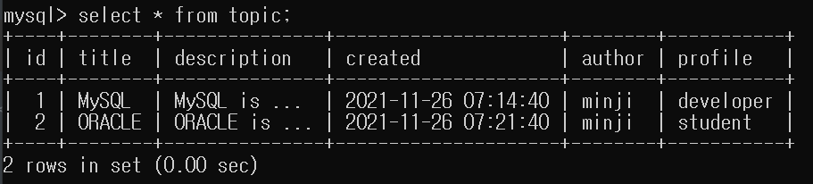
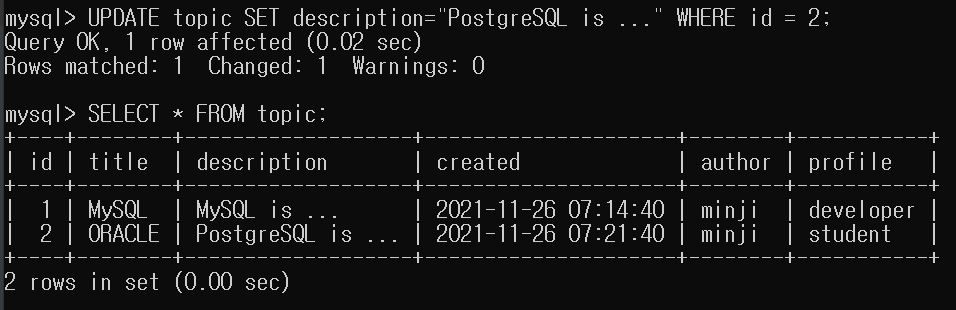
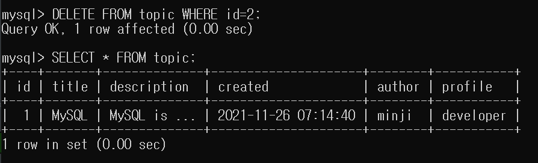

# SQL CRUD

- create
- read
- update
- delete

<br>

## ✅ CREATE

```mysql
INSERT INTO table_name (column1, column2, column3, ...)
VALUES (value1, value2, value3, ...);
```

```mysql
INSERT INTO topic (title, description, created, author, profile) 
VALUES ("MySQL", "MySQL is ...", NOW(), "minji", "developer");
```

<br>

## ✅ READ

```mysql
SELECT column1, column2, ... FROM table_name;
```

```mysql
select * from topic;
```

<br>


<br>

## ✅ UPDATE

```mysql
UPDATE table_name
SET column1 = value1, column2 = value2, ...
WHERE condition;
```

```mysql
UPDATE topic SET description="PostgreSQL is ..." WHERE id = 2;
```

<br>





<br>

## ✅ DELETE

```mysql
DELETE FROM table_name WHERE condition;
```

```mysql
DELETE FROM topic WHERE id=2;
```

<br>

