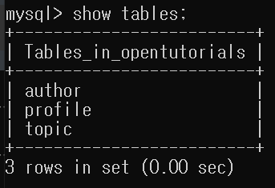

# SQL을 사용해보자.

- SQL 사용

<br>

## ✅ SQL (Structured Query Language)  

SQL은 MySQL Server에게 소통하는 언어이다.

<br>

## ✅ SQL 사용

### 테이블 생성

```mysql
CREATE TABLE topic(
    id INT(11) NOT NULL AUTO_INCREMENT,
    title VARCHAR(100) NOT NULL,
    description TEXT NULL,
    created DATETIME NOT NULL,
    author VARCHAR(30) NULL,
    profile VARCHAR(100) NULL,
    PRIMARY KEY(id));
```

id INT(11) 👉  숫자 검색 같은 것 할 때 얼마까지만 노출할 것이냐를 정하는 것  

<br>

### 테이블 정보 보기

```mysql
desc [테이블 이름];
```

```mysql
desc topic;
```


<br>

### 사용 중인 데이터베이스의 테이블 목록 보기

```mysql
show tables;
```


