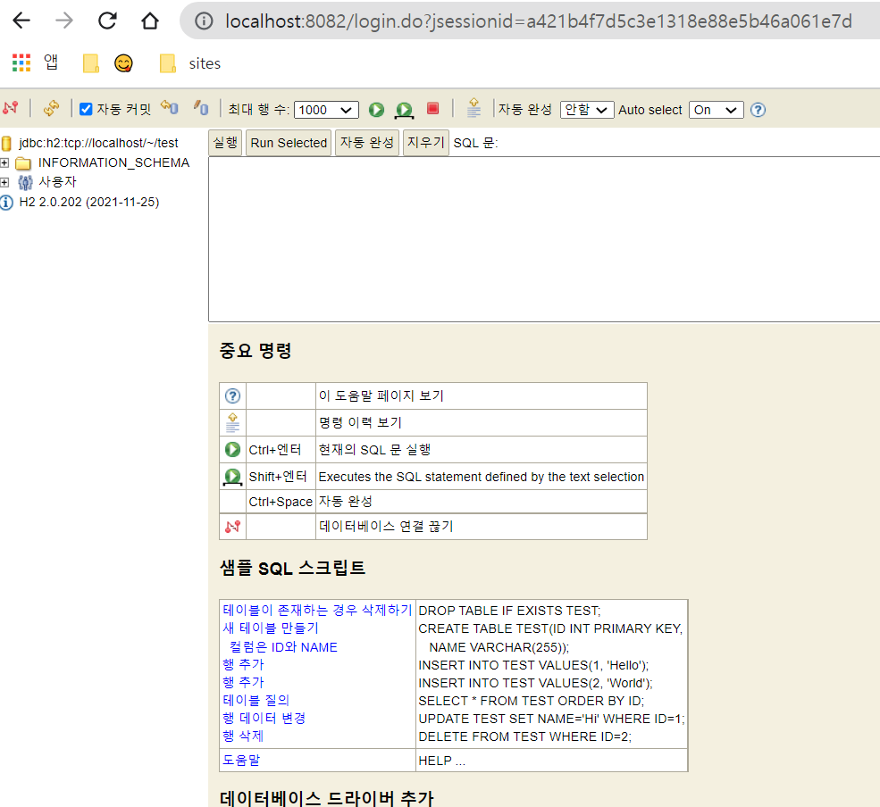

## H2 DB 연동 오류

오류 화면을 캡처를 못했다ㅜㅜ 위의 화면 아래 빨간 줄로 **Database "C:/Users/jmj/test" not found, either pre-create it or allow remote database creation...** 오류가 떠서 해결법을 찾아보았다.

 

## 해결

C:/Users/jmj 경로에 test.mv.db 의 빈 파일을 만들어주면 된다. 

연결이 잘 된다!