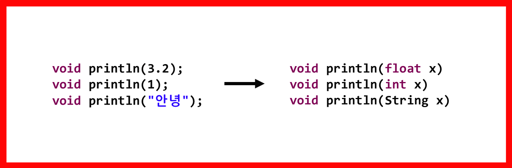

# 오버로딩

-   오버로딩이란?
-   오버로딩 조건
-   오버로딩 예시

 

### ✅ 오버로딩이란?

한 클래스에 같은 이름의 메서드를 여러 개 정의하는 것

 

### ✅ 오버로딩 조건

-   메서드 **이름** 같아야 한다.
-   매개변수의 **개수**가 같거나 **타입**이 달라야 한다.
-   반환 타입은 관계없다.

 

### ✅ 오버로딩 예시

대표적인 오버로딩된 메서드는 println이다.  println 메서드 하나로 정수, 실수, 문자, 문자열 등 다양한 타입의 매개변수를 사용할 수 있던 것은 오버로딩 덕분이다.

 

다음과 같이 오버로딩 되어있어서 매개변수에 다양한 타입을 넣어서 출력할 수 있는 것이다. 위 예시 말고도 println 메서드는 더 많은 타입으로 정의 되어있다.