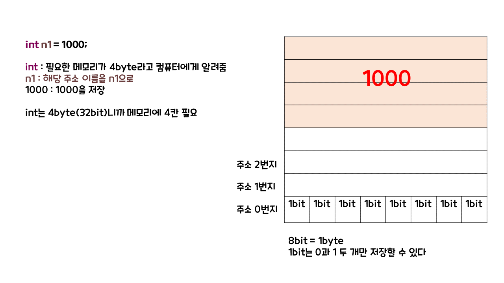

# 자료형과 메모리

- boolean
- int
- double
- char

 

| 자료형  | 몇 비트 |
| ------- | ------- |
| boolean | 1bit    |
| int     | 32bit   |
| double  | 64bit   |
| char    | 16bit   |

 

## 그럼 메모리에 어떻게 저장될까?

