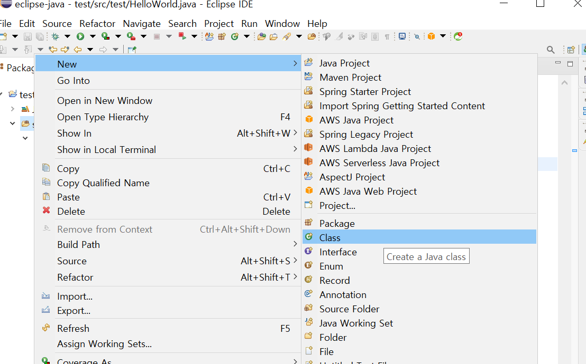
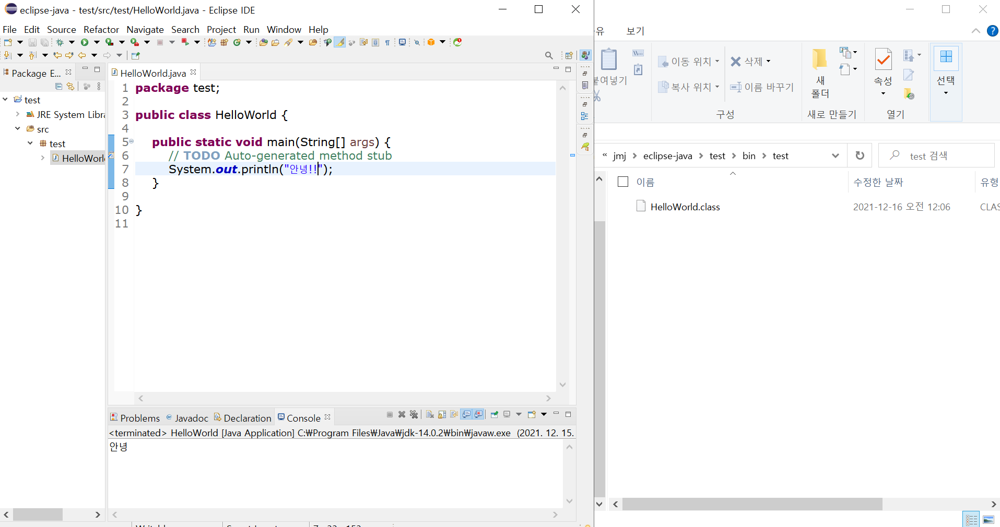

# 자바 실행 과정과 메모리

- 운영체제
- 자바 실행 과정
- 환경 변수 
- 자바 메모리 구조

<br>

운영체제의 역할이 여러 가지 있지만, 그중 사용자의 명령을 받아서 하드웨어를 직접 제어하는 역할이 있다. 사용자는 보통 키보드나 마우스라는 인터페이스로 운영체제에 명령을 내린다. 그런데 키보드나 마우스 말고 자바라는 언어로도 운영체제에 명령을 내릴 수 있다. 

자바라는 언어로 OS에게 명령하려면 도구가 필요한데, 그 도구가 바로 JDK이다. 사용자의 운영체제 종류에 맞는 JDK를 설치해야지 운영체제가 잘 알아들을 수 있다. 

<br>

## 환경 변수

JDK를 설치하면 환경변수라는 것을 설정한다. 이 과정을 진행하는 이유는 무엇일까? 바로 자바 명령어를 어디서든지 사용할 수 있게 하는 것이다. 만약 환경변수 설정을 안 하고 CLI에서 아무 디렉터리에서 자바 명령어를 입력하면 알 수 없는 명령어라는 식의 문구가 나온다. 하지만 환경변수를 설정하고 다시 아무 디렉터리 가서 자바 명령어를 실행하면 잘 되는 것을 확인할 수 있다.

<br>

## 자바 실행 과정

.java 파일을 Javan.exe 실행 파일이 실행되면 .class 파일이 생긴다. 이 .class 파일은 JVM이 이해할 수 있는 언어이다. 그다음 java.exe 실행파일로  .class 파일을 실행하면 JVM에 전달이 되고 JVM이 운영체제에 전달하여 프로그램이 실행된다.

.java 파일에서 .class로 변환되는 과정을 컴파일이라고 한다. 

사용자가 test.java라는 파일을 만들었다고 하자. 아래 사진의 이클립스에서 class 만드는 것과 같다. 이클립스에서는 위 과정을 간단하게 실행할 수 있다. 

<br>



위 사진은 이클립스에서 class 파일을 만드는 것이 .java파일을 만드는 것이다.

<br>

```java
public class HelloWorld {

	public static void main(String[] args) {
		// TODO Auto-generated method stub
		System.out.println("안녕!!");
	}
}
```

자바 파일에 자바 언어로 안녕!! 을 출력하는 프로그램을 만들고 ctrl + s 를 키보드로 누르면 컴파일이 되어서 .class 파일이 생기는데 이 과정을 이클립스가 자동으로 해주는 것이다.

<br>



이클립스에서 저장을 하였더니 진짜 .class 파일이 생겼다. 참고로 사진에 보이는 bin 폴더에  .class 파일이 모여진다.

그다음 초록색 화살표 버튼을 누르거나 ctrl + f11을 누르면 프로그램이 실행된다. 이는 java.exe파일이 실행된 것과 같은 것이다. 

<br>

## 자바 메모리 구조

static - 프로그램 시작 전부터 프로그램이 종료될 때까지 존재

heap - 프로그램에서 잠깐 있다가 사라지는 데이터들

stack - 행위같은 것들

<br>

[📕 참고 강의](https://www.easyupclass.com/main/course_info/about.php?course_id=274)