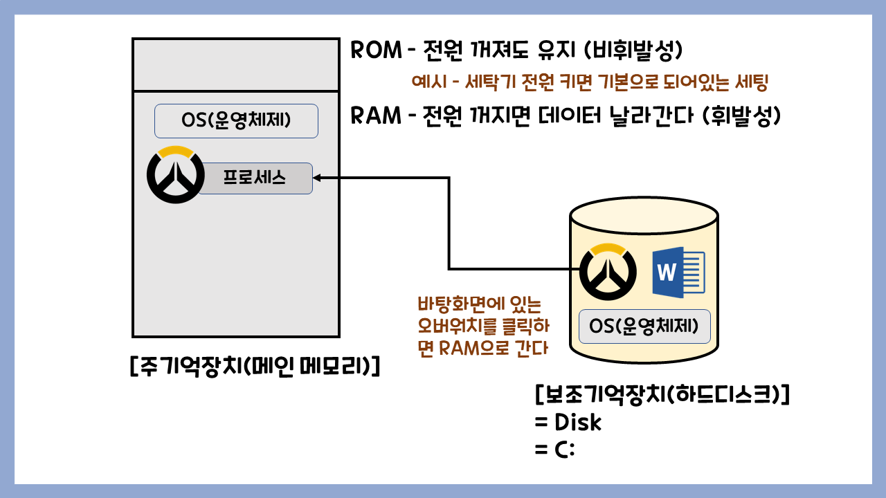

# 운영체제란?

1. 운영체제는 시스템 SW이다. 

2. 컴퓨터에 존재하는 자원을 관리한다. 

   - HW : CPU, 메모리, I/O, 주변 장치

   - SW : 여러가지 프로그램    

3. 사용자의 편의성을 제공한다.

 

## ✅ ROM과 RAM

초기에는 ROM에 운영체제를 실행하였다. 하지만 여러가지 문제로인해서 현재는 RAM에 적재하여 실행하고 ROM에는 컴퓨터를 운영하기 위해서 꼭 필요한 존재인 아주 기초적인 프로그램이 들어있다.

 

- ROM : Read Only Memory 읽기만 가능하다. 내용을 집어넣을수는 있지만 수정할수는 없다. 전원이 공급되어도 남아있다.
- RAM : Random Access Memory 내용을 집어넣을 수 있고, 내용도 수정할 수 있다. 전원 없으면 날라간다. 작업공간이라고 생각하면된다. 하드디스크에 있는 워드프로그램을 더블클릭하는 행위가 ram에 올리는 행위이다.m그럼 워드프로그램은 실행하는 프로그램인 프로세스가 된다. 

헷갈리지 말 것

cpu :프로세서

프로세스 :실행중인 프로그램 

하드디스크에 있던 OS가 전원이 켜지면 RAM에 적재하는것을 '부팅'한다 라고 한다.

(하드디스크에 있는 운영체제를 RAM(메모리)올리는 과정을 boot strapping Loader 라고 한다.)

boot strapping Loader에 의해서 운영체제게 RAM에 적재가 된다.

이것을 누가해?

ROM이~~

-> 전원을 키면 ROM안에서  POST라는 작업을 하여 자기 자신을 점검하고.  그 다음 ROM-BIOS(rom안에 들어가있는 입출력 시스템)가 활성화되어 기본입출력 시스템 활성화 시키고,  boot-strap-loader 에 의해서 하드디스크에 있는 OS가 RAM으로 간다.

[최희준 교수님 운영체제](https://www.youtube.com/watch?v=l99iCWYEGqc)