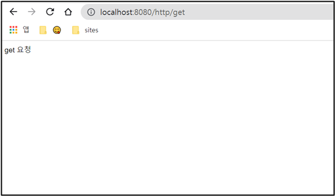
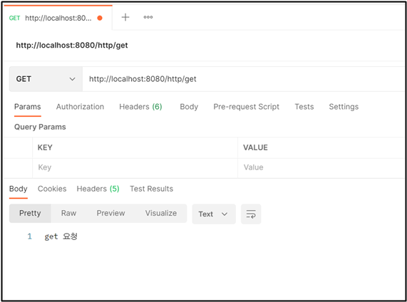
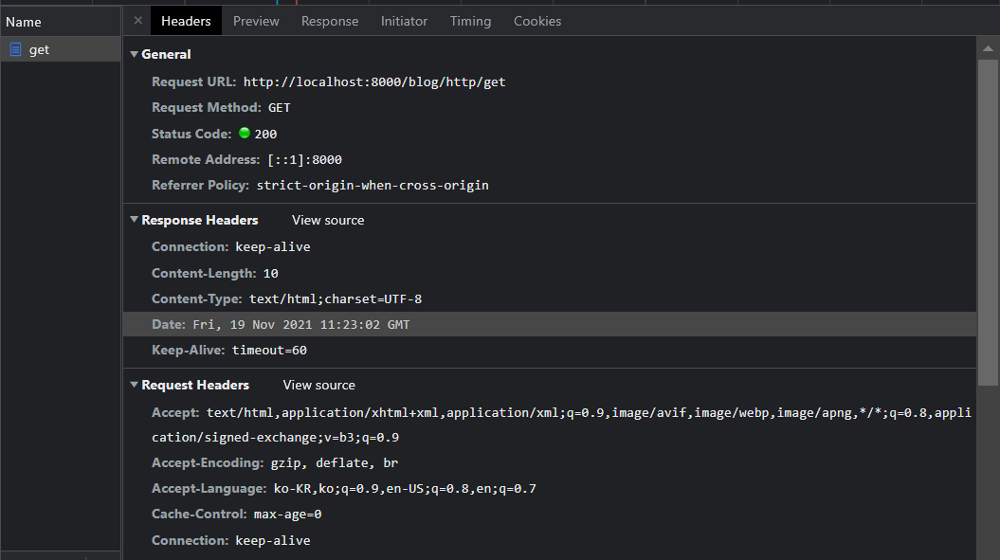

# HTTP 요청 실습 

## ✅ 통신 방법

- **GET** 👉 데이터를  줘 👉 서버는 select 수행
- **POST** 👉 데이터를 추가해줘 👉 서버는 insert 수행
- **PUT** 👉 데이터를 수정해줘 👉 서버는 update 수행
- **DELETE** 👉 데이터를 삭제해줘 👉 서버는 delete 수행

<br>

## ✅ GET 실습

### HttpControllerTest

```java
package com.cos.blog.test;

import org.springframework.web.bind.annotation.DeleteMapping;
import org.springframework.web.bind.annotation.GetMapping;
import org.springframework.web.bind.annotation.PostMapping;
import org.springframework.web.bind.annotation.PutMapping;
import org.springframework.web.bind.annotation.RestController;

// 사용자가 요청했을 때 -> 응답을 HTML 파일로 하려면
// @Controller 사용

// 사용자가 요청했을 때 -> 응답을 Data로 받을라면
// @RestController 사용

@RestController
public class HttpControllerTest {
	
	// 인터넷 브라우저 요청은 무조건 get 요청밖에 할 수 없다.
	
	// http://localhost:8080/http/get
	@GetMapping("/http/get")
	public String getTset() {
		return "get 요청";
	}
	
	// http://localhost:8080/http/post
	@PostMapping("/http/post")
	public String postTset() {
		return "post 요청";
	}
	
	// http://localhost:8080/http/put
	@PutMapping("/http/put")
	public String putTset() {
		return "put 요청";
	}
	
	//  http://localhost:8080/http/delete
	@DeleteMapping("/http/delete")
	public String deleteTset() {
		return "delete 요청";
	}
}
```

브라우저 요청은 get 요청밖에 못 하니까 ge t요청 테스트해보기

<br>

### 결과



브라우저에 http://localhost:8080/http/get 입력하면 성공!

<br>



Postman에서도 잘 된다.

<br>



개발자도구로 저런 정보도 확인해보자~

<br>

## ✅ POST 실습


POST 요청도 결과 잘 나온다!
