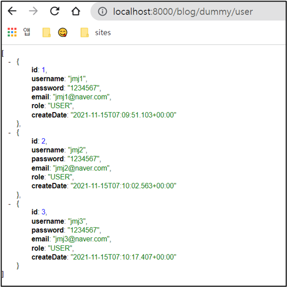

# select 테스트 - 여러 건의 데이터 

- 여러 건 select 실습
- 크롬 확장 프로그램 설치 - JSONview

<br>

## select - 여러 건

```java
package com.cos.blog.test;

import java.util.List;
import java.util.function.Supplier;

import org.springframework.beans.factory.annotation.Autowired;
import org.springframework.web.bind.annotation.GetMapping;
import org.springframework.web.bind.annotation.PathVariable;
import org.springframework.web.bind.annotation.PostMapping;
import org.springframework.web.bind.annotation.RestController;

import com.cos.blog.model.RoleType;
import com.cos.blog.model.User;
import com.cos.blog.repository.UserRepository;

@RestController
public class DummyControllerTest {
	@Autowired 
	private UserRepository userRepository;
	
	// http://localhost:8000/blog/dummy/user
	@GetMapping("/dummy/user")
	public List<User> list(){
		return userRepository.findAll(); 
	}
}

```

<br>

### 결과



전체 데이터가 잘 불러온다. (JSONview 덕분에 깔끔하게 보인다.)

