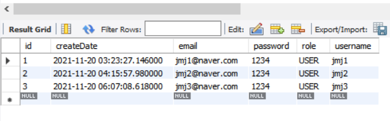
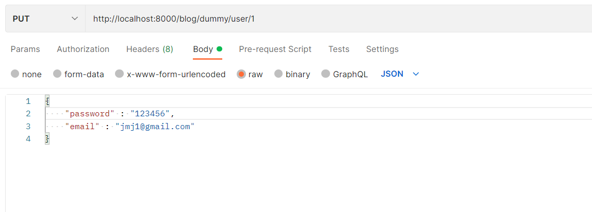
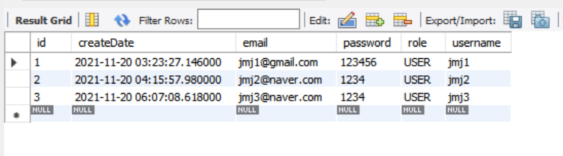

# update 테스트

```java
	// http://localhost:8000/blog/dummy/user/1
	// save 함수는 id를 전달하지 않으면 insert를 해주고
	// save 함수는 id를 전달하면 해당 id에 데이터가 있으면 update 해주고
	// save 함수는 id를 전달하면 해당 id에 데이터가 없으면 insert 한다.
	@Transactional // save 함수 호출 안 해도 함수 종료시에 자동 commit 이 됨. // 더티 체킹
	@PutMapping("/dummy/user/{id}")
	public User updateUser(@PathVariable int id, @RequestBody User requestUser) { //json 데이터를 요청 => Java Object(MessageConverter의 Jackson라이브러리가 변환해서 받아.)

		// 실제 DB에서 받은 user
		User user = userRepository.findById(id).orElseThrow(()->{
			return new IllegalArgumentException("수정에 실패하였습니다.");
		});

		user.setPassword(requestUser.getPassword());
		user.setEmail(requestUser.getEmail());
		
		return user;
	}	
```

<br>



update하기 전에 DB

<br>



update 해보자

<br>



수정 잘 되었다!
