# # 프로젝트 생성 및 설정

## ✅ 프로젝트 생성

### ✔ 프로젝트 생성

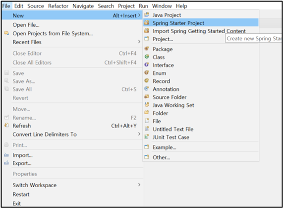

<br>

### ✔ 이름 변경

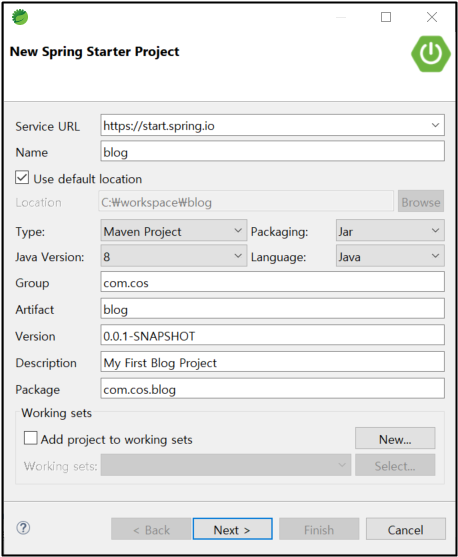

Maven, Java 8, Jar…. 등을 설정해주고 이름과 패키지 이름 변경하고 Next! 그 안에다가 넣었다.

<br><br>

## ✅ 프로젝트 의존 설정
### ✔ 의존 설정

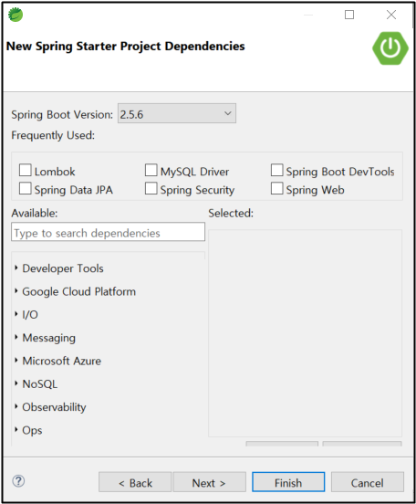

그다음 의존 설정해야 한다. 강의에서는 검색해서 추가로 설정해주었는데 이렇게 하면 프로젝트 생성 도중에 79%에서 멈춰버린다. 그래서 일단 Finish 눌러서 프로젝트 생성하고 강사님 깃허브에 가서 pom.xml 복사해서 내 프로젝트에 복사해 붙였다. 😆

<br>

### ✔ pom.xml

```xml
<?xml version="1.0" encoding="UTF-8"?>
<project xmlns="http://maven.apache.org/POM/4.0.0" xmlns:xsi="http://www.w3.org/2001/XMLSchema-instance"
	xsi:schemaLocation="http://maven.apache.org/POM/4.0.0 https://maven.apache.org/xsd/maven-4.0.0.xsd">
	<modelVersion>4.0.0</modelVersion>
	<parent>
		<groupId>org.springframework.boot</groupId>
		<artifactId>spring-boot-starter-parent</artifactId>
		<version>2.5.6</version>
		<relativePath/><!-- lookup parent from repository --></parent>
	<groupId>com.cos</groupId>
	<artifactId>blog</artifactId>
	<version>0.0.1-SNAPSHOT</version>
	<name>blog</name>
	<description>My First Blog Project</description>
	<properties>
		<java.version>1.8</java.version>
	</properties>

	<dependencies>
<!-- 기본으로 있었음 --><dependency>
			<groupId>org.springframework.boot</groupId>
			<artifactId>spring-boot-starter</artifactId>
		</dependency>

<!-- 기본으로 있었음 --><dependency>
			<groupId>org.springframework.boot</groupId>
			<artifactId>spring-boot-starter-test</artifactId>
			<scope>test</scope>
		</dependency>

<!-- Spring Data JPA --><!--
		<dependency>
			<groupId>org.springframework.boot</groupId>
			<artifactId>spring-boot-starter-data-jpa</artifactId>
		</dependency>
		-->

<!-- Spring Security --><!--
		<dependency>
			<groupId>org.springframework.boot</groupId>
			<artifactId>spring-boot-starter-security</artifactId>
		</dependency>
		 -->

		<dependency>
			<groupId>org.springframework.boot</groupId>
			<artifactId>spring-boot-starter-web</artifactId>
		</dependency>

<!-- Spring Boot DevTools --><dependency>
			<groupId>org.springframework.boot</groupId>
			<artifactId>spring-boot-devtools</artifactId>
			<scope>runtime</scope>
			<optional>true</optional>
		</dependency>

<!-- MySQL Driver --><dependency>
			<groupId>mysql</groupId>
			<artifactId>mysql-connector-java</artifactId>
			<scope>runtime</scope>
		</dependency>

<!-- Lombok --><dependency>
			<groupId>org.projectlombok</groupId>
			<artifactId>lombok</artifactId>
			<optional>true</optional>
		</dependency>

<!-- 추가 라이브러리 시작 --><!-- 시큐리티 태그 라이브러리 --><!--
			<dependency>
				<groupId>org.springframework.security</groupId>
				<artifactId>spring-security-taglibs</artifactId>
			</dependency>
			 -->

<!-- JSP 템플릿 엔진 --><dependency>
				 <groupId>org.apache.tomcat</groupId>
				 <artifactId>tomcat-jasper</artifactId>
				 <version>9.0.22</version>
			</dependency>

<!-- JSTL --><dependency>
				<groupId>javax.servlet</groupId>
				<artifactId>jstl</artifactId>
				<version>1.2</version>
			</dependency>
<!-- 추가 라이브러리 종료 --></dependencies>

	<build>
		<plugins>
			<plugin>
				<groupId>org.springframework.boot</groupId>
				<artifactId>spring-boot-maven-plugin</artifactId>
			</plugin>
		</plugins>
	</build>

</project>
```

주석 처리할 거 하기

<br><br>

## ✅ 테스트

### ✔ 패키지 생성

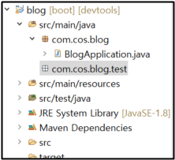

com.cos.blog.test라는 패키지를 만든다.

<br>

### ✔ 클래스 생성

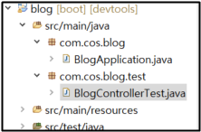

테스트해볼 클래스인 BlogControllerTest를 만든다.

<br>

### ✔ BlogControllerTest.java

```java
package com.cos.blog.test;
import org.springframework.web.bind.annotation.GetMapping;
import org.springframework.web.bind.annotation.RestController;

@RestController
public class BlogControllerTest {

//http://localhost:8080/test/hello@GetMapping("/test/hello")
	public String hello() {
		return "<h1>Hello spring boot<h1>";
	}
}
```

<br>

### ✔ 실행

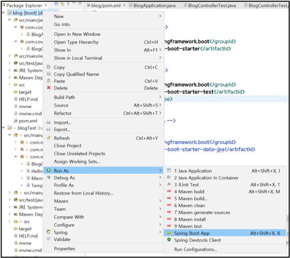

<br>

### ✔ 결과

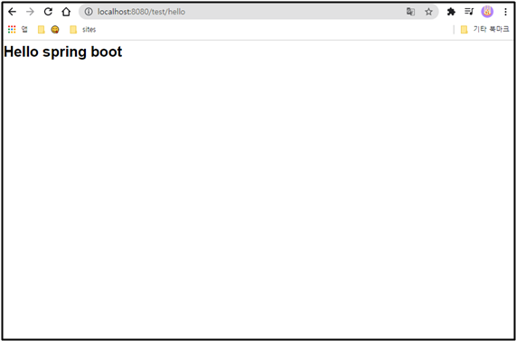

@GetMapping 으로 설정한 URL인 http://localhost:8080/test/hello 주소를 브라우저에 입력하면 결과가 잘 나온다.

<br><br>

## ✅ JPA, MySQL 스프링부트 연결

### ✔ Workbench 사용

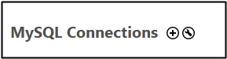

Workbench 들어가서 + 버튼누르고 root 계정으로 들어간다.

<br>

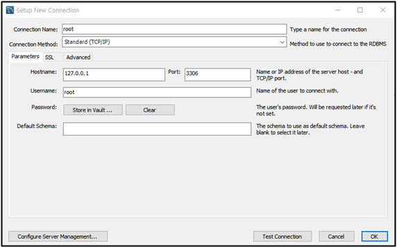

Test Connection 누르고 비번 입력하고 OK

<br>

### ✔ 유저 생성

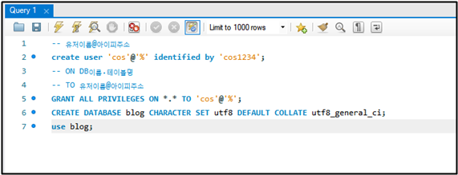

```
-- 유저이름@아이피주소create user 'cos'@'%' identified by 'cos1234';
-- ON DB이름.테이블명-- TO 유저이름@아이피주소GRANT ALL PRIVILEGES ON *.* TO 'cos'@'%';
CREATE DATABASE blog CHARACTER SET utf8 DEFAULT COLLATE utf8_general_ci;
use blog;
```

위의 쿼리문을 실행한다. (그다음 한글 설정하는데 그건 정리 안 함)

<br><br>

## ✅ MySQL 프로젝트 연결

이제 스프링을 데이터베이스에 연결할 것이다.

### ✔ 파일 이름 변경

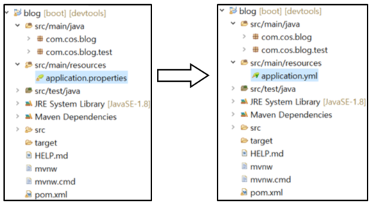

<br>

### ✔ 파일 수정

```yaml
spring:
  datasource:
    driver-class-name: com.mysql.cj.jdbc.Driver
    url: jdbc:mysql://localhost:3306/blog?serverTimezone=Asia/Seoul
    username: cos
    password: cos1234
```

yml 파일에 위의 코드를 추가한다.

참고로 yml 파일에 모든 스프링에 대한 설정을 다 할 수 있다.
<br><br><br><br>

> ### 📕 참고
> [강의] https://www.youtube.com/watch?v=6bhF5o4gAOs&list=PL93mKxaRDidECgjOBjPgI3Dyo8ka6Ilqm
