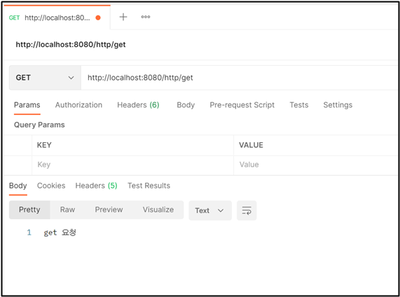
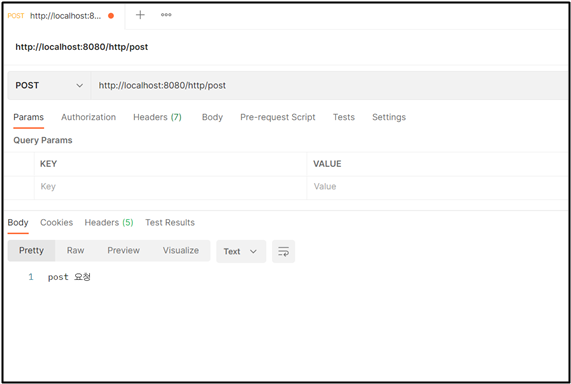

# HTTP 요청 실습

## ✅ 통신 방법

GET 데이터를 줘 -> 서버는 select 수행

POST 데이터를 추가해줘 -> 서버는 insert 수행

PUT 데이터를 수정해줘 -> 서버는 update 수행

DELETE 데이터를 삭제해줘 -> 서버는 delete 수행

<br><br>

## ✅ GET 실습

### ✔ HttpControllerTest 파일 추가

```java
package com.cos.blog.test;

import org.springframework.web.bind.annotation.DeleteMapping;
import org.springframework.web.bind.annotation.GetMapping;
import org.springframework.web.bind.annotation.PostMapping;
import org.springframework.web.bind.annotation.PutMapping;
import org.springframework.web.bind.annotation.RestController;

// 사용자가 요청했을 때 -> 응답을 HTML 파일로 하려면// @Controller 사용// 사용자가 요청했을 때 -> 응답을 Data로 받으려면// @RestController 사용@RestController
public class HttpControllerTest {

// 실제 주소 -> http://localhost:8080/http/get@GetMapping("/http/get")
// return하는 데이터는 문자열이여서 Stringpublic String getTset() {
		return "get 요청";
	}

// 실제 주소 -> http://localhost:8080/http/post@PostMapping("/http/post")
	public String postTset() {
		return "post 요청";
	}

// 실제 주소 -> http://localhost:8080/http/put@PutMapping("/http/put")
	public String putTset() {
		return "put 요청";
	}

// 실제 주소 -> http://localhost:8080/http/delete@DeleteMapping("/http/delete")
	public String deleteTset() {
		return "delete 요청";
	}

}
```

com.cos.blog.test 경로에 HttpControllerTest 클래스 파일을 만들고, 위 코드를 입력한다.

<br>

### ✔ 결과


브라우저에 http://localhost:8080/http/get 입력하면 성공!

<br>



Postman에서도 잘 된다.

<br><br>

## ✅ POST 실습



POST 요청도 결과 잘 나온다!
