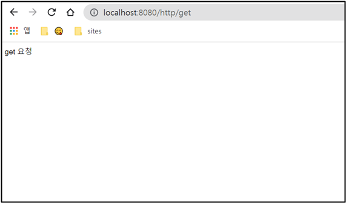

# 오류 Cannot Connect To Database Server

## ✅ 오류 화면


앞의 포스팅에서 처음 실행했을 때 콘솔 창에 오류가 나서 Workbench 들어가서 DB 클릭하니까 다음과 같은 오류를 만났다. 매우 당황;;

<br><br>

## ✅ 해결 방법

### ✔ 서비스 들어가기


<br>

### ✔ MySQL 중지


MySQL 찾아서 중지시킨다.

<br>

### ✔ my.ini 파일 수정


나 같은 경우에 C:\ProgramData\MySQL\MySQL Server 8.0 경로로 들어가면 my.ini 파일이 있다.

**SERVER SECTION** 부분 찾아가서 빨간 박스를 추가하고 저장한다.

```
bind-address=127.0.0.1
```

<br>

### ✔ 재실행

서비스 다시가서 MySQL 중지 시킨거 시작 누른다.

<br><br>

## ✅ 결과



오류 없이 잘 된다!
