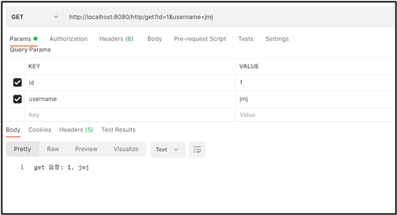
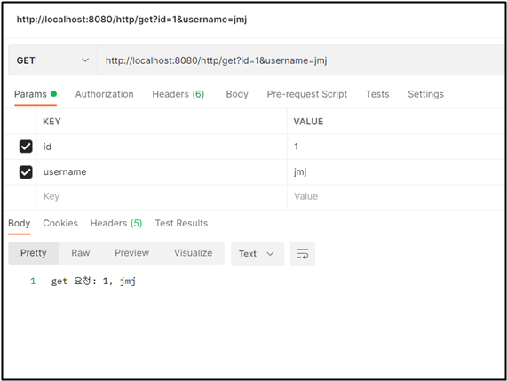
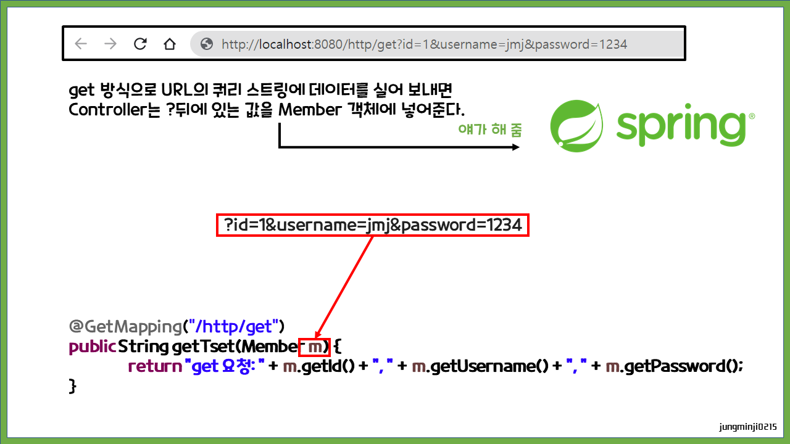
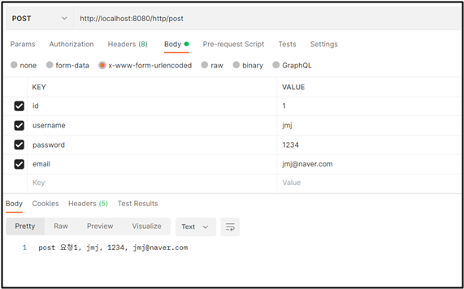

# HTTP 요청

HTTP 요청 시 데이터를 어떻게 실어 보내는지, 어떤 데이터를 요청하고 수정하고 하는지에 대해 배우자.

<br>

## ✅ GET 방식

### ✔ id 

```java
@GetMapping("/http/get")
public String getTset(@RequestParam int id) {
	return "get 요청: " + id;
}
```

HttpControllerTest 클래스의 getTset 메소드의 매개변수로 **@RequestParam int id**를 추가한다.

주소창에 http://localhost:8080/http/get?id=1 입력하면 public String getTset(@RequestParam int id) 여기에 쿼리 스트링의 값이 들어간다. (?id=1 부분이 쿼리 스트링이다.)

참고로 get 방식으로 데이터를 요청할 때 어떤 데이터를 요청할 건지 등에 대한 요청방법은 쿼리 스트링 방법뿐!

 <br>

### ✔ 결과


잘 나온다!

<br>

### ✔ id, username 

```java
@GetMapping("/http/get")
public String getTset(@RequestParam int id, @RequestParam String username) {
	return "get 요청: " + id + ", " + username;
}
```

HttpControllerTest 클래스의 getTset 메소드의 매개변수로 **@RequestParam String username**을 하나 더 추가하고 id와 username return 해보자.

<br>



잘 나온다!

<br>

하지만 매개변수에 하나하나 추가해서 하나씩 받는 거는 비효율적이다. 한꺼번에 받도록 하자!

그 방법은 Member 클래스 생성해서 필요한 변수 다 만들고 Member 객체를 매개변수로 넣어주는 것이다.

<br>

### ✔ Member 클래스 생성

```java
package com.cos.blog.test;

public class Member {
	
	// 자바에서 변수는 다 private로 만든다
	// 함수를 통해서 접근해야함
	private int id;
	private String username;
	private String password;
	private String email;
	
	// 생성자
	public Member(int id, String username, String password, String email) {
		this.id = id;
		this.username = username;
		this.password = password;
		this.email = email;
	}
	
	public int getId() {
		return id;
	}
	public void setId(int id) {
		this.id = id;
	}
	public String getUsername() {
		return username;
	}
	public void setUsername(String username) {
		this.username = username;
	}
	public String getPassword() {
		return password;
	}
	public void setPassword(String password) {
		this.password = password;
	}
	public String getEmail() {
		return email;
	}
	public void setEmail(String email) {
		this.email = email;
	}
	
}
```

com.cos.blog.test 패키지에 Member 클래스를 만든다.

<br>

```java
@GetMapping("/http/get")
public String getTset(Member m) {
	return "get 요청: " + m.getId() + ", " + m.getUsername();
}
```

getTest 메소드를 수정한다. 

<br>



Postman으로 다시 테스트! 결과가 똑같다!

<br><br>

## ✅ 동작 방식



<br><br>

## ✅ POST 

POST 요청은 GET 요청과 다르게, 데이터를 Body로 보낸다. 그때 방식이 매우 많은데 form 태그로 보내는 것을 실습해보자!

<br>

### ✔ x-www-form-urlencoded

```html
<form>
  <input type=" ">
</form>
```

x-www-form-urlencoded는 위의 코드 예시처럼 HTML의 <form>으로 데이터를 요청하는 거랑 같다. 위 사진의 빨간 칸에 x-www-form-urlencoded를 선택하고 요청을 보내면 실제로 html 파일을 만들지는 않았지만, 실제 만든 것처럼 테스트할 수 있다. 

<br>

```java
@PostMapping("/http/post")
public String postTset(Member m) {
	return "post 요청" + m.getId() + ", " + m.getUsername() + ", " + m.getPassword() + ", " + m.getEmail();
}
```

postTset 메소드

<br>

#### ✔ 실습



다음과 같이 KEY와 VALUE를 입력한 뒤 요청하면 성공!