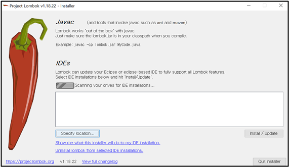

# Lombok

**C:\Users\jmj\.m2\repository** 다음 경로는 내 컴퓨터에서 Maven 이 관리하는 라이브러리들이다. 이것들은 pom.xml에 기술만 하면 자동으로 다운이 된 것들이다. (Maven의 유용성ㅎㅎ)

 <br>

## ✅ Lombok을 STS에 인식시키기

```xml
<!-- Lombok -->
<dependency>
    <groupId>org.projectlombok</groupId>
    <artifactId>lombok</artifactId>
    <optional>true</optional>
</dependency>
```

pom.xml에 쓰인 Lombok 설치 경로가 보인다. C:\Users\jmj\.m2\repository\org\projectlombok\lombok 여기로 들어간다. 그러면 설치된 것들이 있을 것이다. C:\Users\jmj\.m2\repository\org\projectlombok\lombok\1.18.22 여기로 들어가면 jar 실행 파일이 있다.

<br>


사진의 파란색 표시가 실행 파일이다. 실행 파일을 찾았으면 STS 툴이 Lombok을 인식할 수 있게 해야 한다.

 <br>


STS 툴을 끄고 해당 경로에서 우클릭 후 Git Bash를 연다. 

 <br>


**java –****jar lombok-1.18.22.jar** 라고 입력! 

<br>



그럼 다음과 같은 화면이 뜬다

<br>


STS 툴을 설치한 경로에 가서 실행 파일 선택 후 설치하면 된다!
