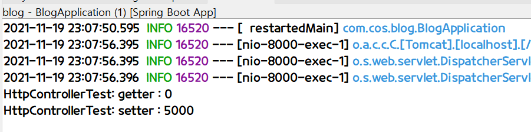

# Lombok 사용해보기

## ✅ Lombok 실습

### Member 클래스 수정

```java
package com.cos.blog.test;

import lombok.AllArgsConstructor;
import lombok.Data;
import lombok.NoArgsConstructor;

//import lombok.Getter;
//import lombok.Setter;
//@Getter
//@Setter

//Getter, Setter 동시에 만들라면 @Data 사용해야 한다.
@Data
@AllArgsConstructor
@NoArgsConstructor
public class Member { 

	private  int id;
	private  String username;
	private  String password;
	private  String email;
	
}
```

Member 클래스를 다음과 같이 변경한다. 

 <br>

### 생성자

**@AllArgsConstructor** - 모든 매개변수를 받는 생성자

> Member m1 = new Member(id, username, password, email);

 <br>

**@NoArgsConstructor** - 빈 생성자

> Member m1 = new Member();

 <br>

### HttpControllerTest 클래스 수정

```java
package com.cos.blog.test;

import org.springframework.web.bind.annotation.DeleteMapping;
import org.springframework.web.bind.annotation.GetMapping;
import org.springframework.web.bind.annotation.PostMapping;
import org.springframework.web.bind.annotation.PutMapping;
import org.springframework.web.bind.annotation.RequestParam;
import org.springframework.web.bind.annotation.RestController;

import com.cos.blog.test.Member;

@RestController
public class HttpControllerTest {
	
	private static final String TAG = "HttpControllerTest: ";
	
	// http://localhost:8080/http/lombok
	@GetMapping("/http/lombok")
	public String lombokTest() { 
		Member m = new Member(1,"minji","1234","email");
		
		System.out.println(TAG + "getter : " + m.getId());
		m.setId(500);
		System.out.println(TAG + "setter : " + m.getId());
		
		return "lombok test 완료";	
	}
}
```

HttpControllerTest 클래스에 lombokTest 메소드를 추가하고 테스트해보자.

 <br>

### 결과


<br>

## @Builder

### Member

```java
// @Builder 실습
package com.cos.blog.test;

import lombok.AllArgsConstructor;
import lombok.Builder;
import lombok.Data;
import lombok.NoArgsConstructor;

@Data
@NoArgsConstructor
public class Member { 
	private  int id;
	private  String username;
	private  String password;
	private  String email;
	
	@Builder
	public Member(int id, String username, String password, String email) {
		super();
		this.id = id;
		this.username = username;
		this.password = password;
		this.email = email;
	}
}
```

<br>

### HttpControllerTest

```java
package com.cos.blog.test;

import org.springframework.web.bind.annotation.DeleteMapping;
import org.springframework.web.bind.annotation.GetMapping;
import org.springframework.web.bind.annotation.PostMapping;
import org.springframework.web.bind.annotation.PutMapping;
import org.springframework.web.bind.annotation.RestController;

@RestController
public class HttpControllerTest {
	
	private static final String TAG = "HttpControllerTest: ";
	
	// http://localhost:8080/http/lombok
	@GetMapping("/http/lombok")
	public String lombokTest() { 
	
        // @Builder 사용법
		Member m = Member.builder().password("1234").username("minji").email("minji@naver.com").build();
		
		System.out.println(TAG + "getter : " + m.getId());
		m.setId(5000);
		System.out.println(TAG + "setter : " + m.getId());
		return "lombok test 완료";	
	}
}
```

데이터 4개 넣어주어야 하는 생성자가 있는데 3개만 넣고 싶을 때, 매개변수 오버로딩 안 해도 된다. 빌터 패턴 쓰면 원하는 것만 순서에 상관없이 사용할 수 있다!

<br>

### 결과



오류 없이 잘 된다.
