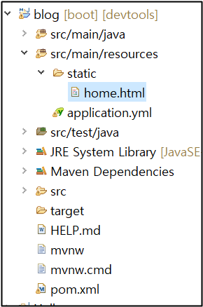
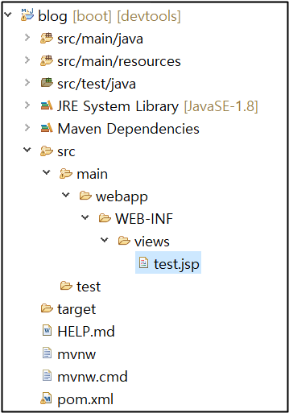

# 스프링 동작 방식

## ✅ 정적 파일

### ✔ TempControllerTest 클래스 생성

```java
package com.cos.blog.test;

import org.springframework.stereotype.Controller;
import org.springframework.web.bind.annotation.GetMapping;

@Controller
public class TempControllerTest {

	// http://localhost:8000/blog/temp/home
	@GetMapping("/temp/home")
	public String tempHome() {
		System.out.println("tempHome()");
		
		//파일 리턴 기본경로 : src/main/resources/static
		return "/home.html";
	}
}
```

TempControllerTest 클래스를 하나 만들자.

- @Controller 👉 파일을 리턴 하겠다.

- @GetMapping("/temp/home") 👉 주소창에 http://localhost:8000/blog/temp/home 라고 입력하면 해당 메소드를 수행하겠다.

  <br>

### ✔ HTML 파일 생성



위의 경로에 HTML 파일을 생성한다. 

<br>

⭐ 파일을 리턴할때 스프링의 기본경로는 **src/main/resources/static**이다. 이때 리턴을 "home.html"이라고 하면 파일을 찾지 못한다. **src/main/resources/statichome.html** 이 되기 때문이다. 그래서 TempControllerTest 클래스에 return을 "/home.html" 이라고 해준 것이다. 그러면 **src/main/resources/static/home.html** 이렇게 최종 경로가 완성!

 <br>

주소창에 http://localhost:8000/blog/temp/home 입력하면 잘 나온다.

 <br><br>

## ✅ 동적 파일

하지만 해당 프로젝트에서는 템플릿엔진을 HTML을 안 쓰고 JSP 파일을 쓸 것이다. 리턴을 JSP 파일을 해줘야 함.

<br>

스프링부트는 JSP 파일을 지원 안 해줘서 pom.xml에 JSP 템플릿 엔진을 의존성 설정해줘야 한다. 그리고 기본경로가 static여서 경로를 바꾸어줘야 한다. static 이하에는 브라우저만 인식 가능한 파일만 올 수 있다. JSP 파일은 컴파일이 일어나야 하는 동적 파일이다. 

 <br>

### ✔ 경로 및 파일 생성



먼저 main 밑에 webapp/WEB-INF/views 경로를 만들고 test.jsp 파일을 만들자

 <br>

### ✔ yml 파일 수정

```yaml
spring:
  mvc:
    view:
      prefix: /WEB-INF/views/
      suffix: .jsp
```

그다음 yml 파일에 위 코드를 써준다.

- prefix 👉 컨트롤러가 리턴할 때 앞에 붙여주는 경로명
- suffix 👉 컨트롤러가 리턴할 때 뒤에 붙여주는 경로명

 <br>

### ✔ TempControllerTest 클래스 수정

```java
package com.cos.blog.test;

import org.springframework.stereotype.Controller;
import org.springframework.web.bind.annotation.GetMapping;

@Controller
public class TempControllerTest {
	// http://localhost:8000/blog/temp/jsp
	@GetMapping("/temp/jsp")
	public String tempJsp() {
		return "test";
	}	
}
```

TempControllerTest에 tempJsp 메소드를 만든다. 

리턴은 test로 해야 한다. /test.jsp 라고 하면 경로가 /WEB-INF/views/**/test.jsp**.jsp 라고 된다.

 <br>

### ✔ 동작 방식

사용자가 http://localhost:8000/blog/temp/jsp 주소를 요청한다.

prefix : /WEB-INF/views/
suffix : .jsp

위 두 가지에 의해서 return 값 양옆으로 붙어서 풀 경로는 /WEB-INF/views/**test**.jsp가 된다.

 <br>

### ✔ 결과


JSP 파일이 잘 리턴 된다!

