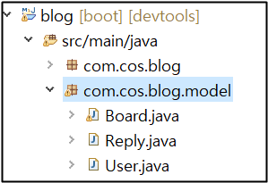
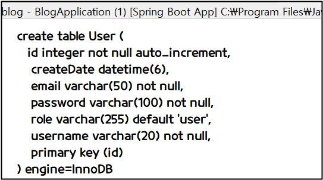
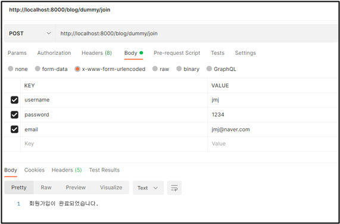
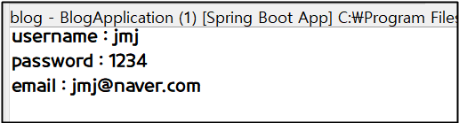
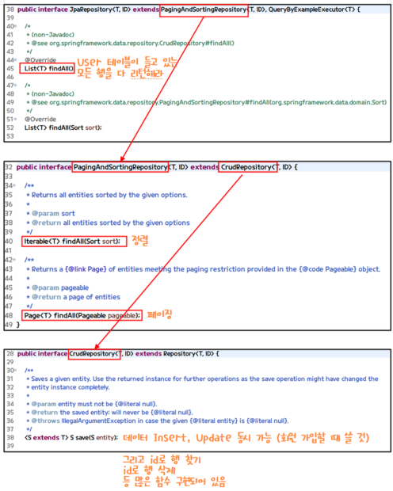

<<<<<<< HEAD
# 테이블 생성

User, Board, Reply 세 개의 테이블을 생성해보자


## ✅ 패키지 생성



model 패키지를 생성한다. com.cos.blog.model 하고 User, Board, Reply 클래스를 만든다.


## ✅ User.java

```java
package com.cos.blog.model;

import java.sql.Timestamp;

import javax.persistence.Column;
import javax.persistence.Entity;
import javax.persistence.GeneratedValue;
import javax.persistence.GenerationType;
import javax.persistence.Id;

import org.hibernate.annotations.ColumnDefault;
import org.hibernate.annotations.CreationTimestamp;

import lombok.AllArgsConstructor;
import lombok.Builder;
import lombok.Data;
import lombok.NoArgsConstructor;

@Data
@NoArgsConstructor
@AllArgsConstructor
@Builder 
@Entity 
public class User {
	@Id 
	@GeneratedValue(strategy = GenerationType.IDENTITY) 
	private int id; 
	
	@Column(nullable = false, length = 20) 
	private String username; 
	
	@Column(nullable = false, length = 100) 
	private String password;
	
	@Column(nullable = false, length = 50) 
	private String email;
	
	@ColumnDefault("'user'")
	private String role; 
	
	@CreationTimestamp
	private Timestamp createDate;
}
```

→ 저장 누르면 연결한 DB에 테이블이 생긴다.


### ✔ GenerationType.IDENTITY

```java
@GeneratedValue(strategy = GenerationType.IDENTITY) 
```

위의 코드가 의미하는 것은 무엇일까? YAML, 파일과 같이 보자.


```yaml
jpa:
    open-in-view: true
    hibernate:
      ddl-auto: create
      naming:
        physical-strategy: org.hibernate.boot.model.naming.PhysicalNamingStrategyStandardImpl
      use-new-id-generator-mappings: false
    show-sql: true
    properties:
      hibernate.format_sql: true
```

```yaml
use-new-id-generator-mappings: false 
```

**false 👉** JPA가  사용하는 기본 넘버링 전략 사용하지 않는다

**true** 👉 JPA가 사용하는 기본 넘버링 전략 사용


## ✅ 추가 기능 살펴보기

### ✔ **ddl-auto: create**

```yaml
jpa:
    open-in-view: true
    hibernate:
      ddl-auto: create
      naming:
        physical-strategy: org.hibernate.boot.model.naming.PhysicalNamingStrategyStandardImpl
      use-new-id-generator-mappings: false
    show-sql: true
    properties:
      hibernate.format_sql: true
```

**ddl-auto: create** 의 의미

- create 👉 프로젝트 실행할 때마다 테이블 새로 만들겠다.

- update 👉 최초일 때만 create하고 나중엔 update 해야된다.

  

### ✔ show-sql



show-sql: true 콘솔 창에 아래처럼 보이게 하는 기능


### ✔  hibernate.format_sql

hibernate.format_sql: true 👉 true로 하면 콘솔 창에 테이블 생성한 것 정렬돼서 나옴


### ✔ physical-strategy

```java
@Column(nullable = false, length = 20) 
	private String username; 
	
	@Column(nullable = false, length = 100) 
	private String password;
	
	@Column(nullable = false, length = 50) 
	private String email;
```

physical-strategy: org.hibernate.boot.model.naming.PhysicalNamingStrategyStandardImpl

테이블 만들 때 변명 그대로 DB에 필드를 넣어준다. 즉 username, password, email이 그대로 들어간다


## ✅ Board.java

```java
package com.cos.blog.model;

import java.time.LocalDateTime;
import java.util.List;

import javax.persistence.CascadeType;
import javax.persistence.Column;
import javax.persistence.Entity;
import javax.persistence.FetchType;
import javax.persistence.GeneratedValue;
import javax.persistence.GenerationType;
import javax.persistence.Id;
import javax.persistence.JoinColumn;
import javax.persistence.Lob;
import javax.persistence.ManyToOne;
import javax.persistence.OneToMany;
import javax.persistence.OrderBy;

import org.hibernate.annotations.ColumnDefault;
import org.hibernate.annotations.CreationTimestamp;

import com.fasterxml.jackson.annotation.JsonIgnoreProperties;

import lombok.AllArgsConstructor;
import lombok.Builder;
import lombok.Data;
import lombok.NoArgsConstructor;

@Data
@NoArgsConstructor
@AllArgsConstructor
@Builder
@Entity
public class Board {
	
	@Id
	@GeneratedValue(strategy = GenerationType.IDENTITY) 
	private int id; 
	
	@Column(nullable = false, length = 100)
	private String title;
	
	@Lob 
	private String content; 

	@ColumnDefault("0")
	private int count; 

	@ManyToOne(fetch = FetchType.EAGER)  // Many = Board,  User = One
	@JoinColumn(name="userId") 
	private User user; 

	@OneToMany(mappedBy = "board", fetch = FetchType.EAGER, cascade = CascadeType.REMOVE) 
	private List<Reply> replys;
	
	@CreationTimestamp
	private LocalDateTime createDate; 
}
```


## ✅ Reply.java

```java
package com.cos.blog.model;

import java.time.LocalDateTime;

import javax.persistence.Column;
import javax.persistence.Entity;
import javax.persistence.GeneratedValue;
import javax.persistence.GenerationType;
import javax.persistence.Id;
import javax.persistence.JoinColumn;
import javax.persistence.ManyToOne;

import org.hibernate.annotations.CreationTimestamp;

import lombok.AllArgsConstructor;
import lombok.Builder;
import lombok.Data;
import lombok.NoArgsConstructor;

@Builder
@AllArgsConstructor
@NoArgsConstructor
@Data
@Entity
public class Reply {
	
	@Id 
	@GeneratedValue(strategy = GenerationType.IDENTITY) 
	private int id;

	@Column(nullable = false, length = 200)
	private String content;
	
	@ManyToOne 
	@JoinColumn(name="boardId") 
	private Board board;
	
	@ManyToOne 
	@JoinColumn(name="userId")
	private User user;
	
	@CreationTimestamp
	private LocalDateTime createDate;
}
```
=======
# 회원가입 위한 insert 테스트 

## ✅ Insert 테스트

```java
package com.cos.blog.test;

import org.springframework.web.bind.annotation.PostMapping;
import org.springframework.web.bind.annotation.RestController;

// 페이지 이동이 아니라 
// 회원 가입이 잘 됐는지 안됐는지만 리턴하는거여서 @RestController 사용
@RestController
public class DummyControllerTest {
	
	// 회원 가입은 -> POST 요청
	// <http://localhost:8000/blog/dummy/join> 주소에 
	// http의 body에 username, password, email 데이터를 가지고 요청하면
	// 3개의 데이터가 join 함수 매개변수에 쏙쏙 들어간다.
	@PostMapping("/dummy/join")
	public  String join(String username, String password, String email) { 
		// key=value 형태로 데이터 받아 -> 약속된 규칙임 (스프링이 제공해주니까 우린 쓰기만 하면 돼)
		// / x-www-form-urlencoded 로 전송되는 데이터는 key=value로 오는데 그것은 
		// 스프링이 함수의 파라미터로 파싱해서 집어 넣어준다
		// 근데 더 강력한 기능도 있음 -> Object로도 받게 해줌 
		// public  String join(User user)
		
		// 실제로 받아지는지 출력
		System.out.println("username : " + username);
		System.out.println("password : " + password);
		System.out.println("email : " + email);
		
		return "회원가입이 완료되었습니다.";	
	}
}
```

com.cos.blog.test 패키지에 DummyControllerTest 클래스 생성하기! Post 요청이기 때문에 Postman 사용해서 테스트한다.

<br>

### ✔ Postman으로 Insert 테스트



<br>



잘 나온다

<br>

⭐ html에서 form 태그를 통해서 데이터를 전송하면 x-www-form-urlencoded 타입으로 전송하게 된다. x-www-form-urlencoded 타입으로 전송된다는 뜻은 데이터를 key=value 형태로 전송한다는 뜻이다. 데이터가 여러 개면 key=value&key=value...

<br><br>

## ✅ 파라미터를 객체로 변경

```java
package com.cos.blog.test;

import org.springframework.web.bind.annotation.PostMapping;
import org.springframework.web.bind.annotation.RestController;

import com.cos.blog.model.User;

@RestController
public class DummyControllerTest {
	@PostMapping("/dummy/join")
	public  String join(User user) { 

		System.out.println("username : " + user.getUsername());
		System.out.println("password : " + user.getPassword());
		System.out.println("email : " + user.getEmail());
		
		// Postman에서 null 값들어옴
		System.out.println("id : " + user.getId());
		System.out.println("role : " + user.getRole());
		System.out.println("createDate : " + user.getCreateDate());
		
		return "회원가입이 완료되었습니다.";
	}
}
```

파라미터를 User 객체로 변경하고 테스트해도 결과 잘 나온다.

<br><br>

## ✅ 데이터베이스에 Insert

### ✔ UserRepository 클래스

```java
package com.cos.blog.repository;

import org.springframework.data.jpa.repository.JpaRepository;

import com.cos.blog.model.User;

// JpaRepository<User, Integer> 의 의미 -> JpaRepository는 User 테이블을 관리하는 Repository
// 그리고 User 테이블의 PK는 Integer
public interface UserRepository extends JpaRepository<User, Integer>{
	//이렇게 만들어지면 JpaRepository는 findAll() 이라는 함수를 가지고 있어
	// findAll() -> User 테이블이 들고있는 모든행을 다 리턴해라

}
```

이제 실제 데이터베스에 넣어볼차례이다. 먼저 패키지 com.cos.blog.repository 를 만들고 패키지 안에 UserRepository 클래스를 만든다.

<br>

### ✔ JpaRepository의 다양한 기능



>>>>>>> 835966636c26840301c8ac962dcae0d58a2d58b7
