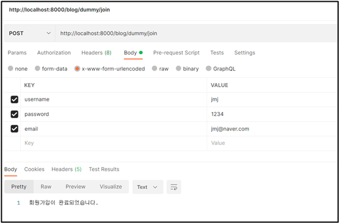
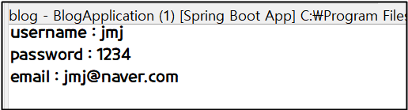
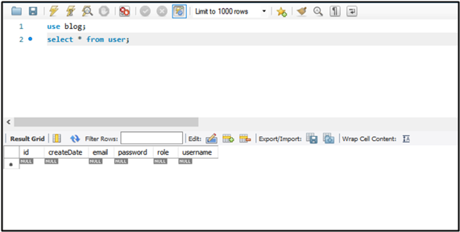
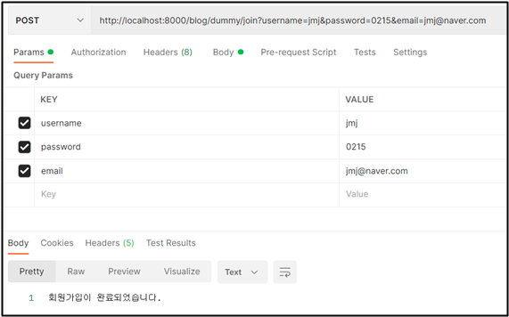
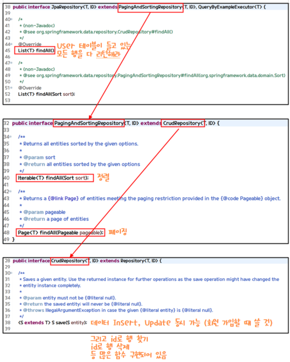

# Insert 테스트

## ✅ Insert 테스트

```java
package com.cos.blog.test;

import org.springframework.web.bind.annotation.PostMapping;
import org.springframework.web.bind.annotation.RestController;

@RestController
public class DummyControllerTest {
	// 회원 가입은 -> POST 요청이다. 
	@PostMapping("/dummy/join")
	public  String join(String username, String password, String email) { 

		System.out.println("username : " + username);
		System.out.println("password : " + password);
		System.out.println("email : " + email);
		
		return "회원가입이 완료되었습니다.";	
	}
}
```

com.cos.blog.test 패키지에 DummyControllerTest 클래스 생성하기! Post 요청이기 때문에 Postman 사용해서 테스트한다. 페이지 이동이 아니라 회원 가입이 잘 됐는지, 안 됐는지만 확인하는 리턴이여서 @RestController 사용한다.

http://localhost:8000/blog/dummy/join 주소에 요청할 때 http의 body에 username, password, email 데이터를 가지고 요청하면 3개의 데이터가 join 함수 파라미터에 쏙쏙 들어간다. (String username, String password, String email) 파라미터 3개는 key=value 형태로 데이터를 받는다. 이것은 약속된 규칙이다! (스프링이 제공해주니까 우린 쓰기만 하면 돼)

<br>

### Postman으로 Insert 테스트



<br>



잘 나온다

⭐ html에서 form 태그를 통해서 데이터를 전송하면 x-www-form-urlencoded 타입으로 전송하게 된다. x-www-form-urlencoded 타입으로 전송된다는 뜻은 데이터를 key=value 형태로 전송한다는 뜻이다. 데이터가 여러 개면 key=value&key=value... 이런 형태. 그리고 이것은 스프링이 함수의 파라미터로 파싱해서 집어넣어 준다.

<br>

### 파라미터를 객체로 변경

```java
package com.cos.blog.test;

import org.springframework.web.bind.annotation.PostMapping;
import org.springframework.web.bind.annotation.RestController;

import com.cos.blog.model.User;

@RestController
public class DummyControllerTest {
	@PostMapping("/dummy/join")
	public  String join(User user) { 

		System.out.println("username : " + user.getUsername());
		System.out.println("password : " + user.getPassword());
		System.out.println("email : " + user.getEmail());
		
		// Postman에서 실습했더니 null 값들어옴
		System.out.println("id : " + user.getId());
		System.out.println("role : " + user.getRole());
		System.out.println("createDate : " + user.getCreateDate());
		
		return "회원가입이 완료되었습니다.";
	}
}
```

파라미터를 Object로도 받게 해준다. public  String join(User user) 이렇게! 파라미터를 User 객체로 변경하고 테스트해도 결과 잘 나온다.

<br>

### repository 생성

```java
package com.cos.blog.repository;

import org.springframework.data.jpa.repository.JpaRepository;

import com.cos.blog.model.User;

// JpaRepository<User, Integer> 의 의미 -> JpaRepository는 User 테이블을 관리하는 Repository
// 그리고 User 테이블의 PK는 Integer이다..
public interface UserRepository extends JpaRepository<User, Integer>{
	//이렇게 만들어지면 JpaRepository는 findAll() 이라는 함수를 가지고 있어
	// findAll() -> User 테이블이 들고 있는 모든 행을 다 리턴해준다.
	// 그뿐만 아니라 아주 많은 기능이 있음! 그래서 기본적인 CRUD도 당연히 다 가능
	// JSP로 치면 DAO 역할임. 

	// 이렇게 하면 bean으로 등록이 되나요? ( bean으로 등록된다는 것은, 스프링 IoC에서 객체를 가지고 있나요?) 
	// (bean으로 등록되면 우리가 필요할 때마다 DI를 할 수 있다.)
	// 위에 대한 답변 -> 등록된다. (자동으로 bean 등록이 된다) 그래서 @Repository 생략할 수 있다.
}
```

패키지 com.cos.blog.repository 를 만들고 패키지 안에 UserRepository 클래스를 만든다.

<br>

### DummyControllerTest 클래스

```java
package com.cos.blog.test;

import org.springframework.beans.factory.annotation.Autowired;
import org.springframework.web.bind.annotation.PostMapping;
import org.springframework.web.bind.annotation.RestController;

import com.cos.blog.model.User;
import com.cos.blog.repository.UserRepository;

@RestController
public class DummyControllerTest {
    
	@Autowired 
	private UserRepository userRepository;
	
	@PostMapping("/dummy/join")
	public  String join(User user) { 
		System.out.println("username : " + user.getUsername());
		System.out.println("password : " + user.getPassword());
		System.out.println("email : " + user.getEmail());
		
		// Postman에서 null 값 들어옴
		System.out.println("id : " + user.getId());
		System.out.println("role : " + user.getRole());
		System.out.println("createDate : " + user.getCreateDate());
		
		userRepository.save(user);
		
		return "회원가입이 완료되었습니다.";
	}
}
```

위의 두 개의 클래스를 작성하고 실행시켜보자.

<br>



실행하기 전에 테이블 확인해보자. Workspace에서 만들어진 테이블 보니까 아직 값이 없다.

<br>



Postman으로 테스트하고 나서 다시 테이블을 확인해보자.

<br>


값이 정상적으로 들어간 것을 확인할 수 있다.

<br>

### @Autowired

```java
@Autowired // 의존성 주입(DI)
private UserRepository userRepository;
```

일단 처음에 userRepository는 null이다. 스프링이 @RestController를 읽어서 DummyControllerTest 클래스를 메모리에 올릴 때 null이야. 이때, @Autowired를 붙여주면 DummyControllerTest가 메모리에 올라갈 때@Autowired도 메모리에 같이 올라간다. 즉, userRepository 얘도 메모리에 같이 올라간다는 뜻! @Autowired는 스프링이 관리하는 UserRepository 타입의 객체가 있으면 userRepository 여기에 넣어준다.

### JpaRepository의 다양한 기능



