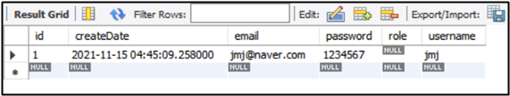
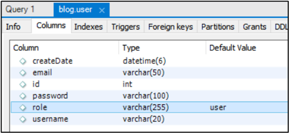
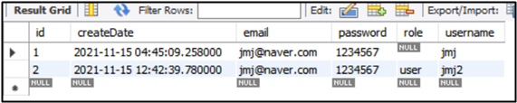
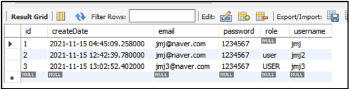

# role에 null 해결 

## ✅ @DynamicInsert




role은 현재 null 값으로 들어가 있다. 

<br>



role은 Default Value가 user이다. 그래서 null 값이 아닌 user로 들어가야 한다.

<br>

```sql
    insert 
    into
        User
        (createDate, email, password, role, username) 
    values
        (?, ?, ?, ?, ?)
```

데이터 삽입될 때 아래와 같이 쿼리 문이 만들어져서 실행되었다.

<br>

```sql
    insert 
    into
        User
        (createDate, email, password, username) 
    values
        (?, ?, ?, ?)
```

하지만 쿼리가 다음과 같이 실행되어야 한다. 쿼리가 이렇게 되어야지 null이 아닌 Default 값인 user가 들어간다.

<br>

### ⚫ @DynamicInsert

```java
package com.cos.blog.model;

import java.sql.Timestamp;

import javax.persistence.Column;
import javax.persistence.Entity;
import javax.persistence.GeneratedValue;
import javax.persistence.GenerationType;
import javax.persistence.Id;

import org.hibernate.annotations.ColumnDefault;
import org.hibernate.annotations.CreationTimestamp;
import org.hibernate.annotations.DynamicInsert;

import lombok.AllArgsConstructor;
import lombok.Builder;
import lombok.Data;
import lombok.NoArgsConstructor;

@Data
@NoArgsConstructor
@AllArgsConstructor
@Builder
@Entity
@DynamicInsert
public class User {
	
	@Id 
	@GeneratedValue(strategy = GenerationType.IDENTITY) 
	private int id; 
	
	@Column(nullable = false, length = 20) 
	private String username; 
	
	@Column(nullable = false, length = 100) 
	private String password;
	
	@Column(nullable = false, length = 50) 
	private String email;
	
	@ColumnDefault("'user'") 
	private String role; 
	
	@CreationTimestamp
	private Timestamp createDate;
}

```

방법은 @DynamicInsert를 붙이는 것이다, @DynamicInsert는 Insert 할 때 null인 필드를 제외해준다. @DynamicInsert를 붙이고 다시 테스트해 보자 .

<br>

### ⚫ 결과



결과가 잘 나왔다.

<br>

하지만 @DynamicInsert 같은 것을 계속 붙이면 끝도 없어짐.. 좋은 방법은 아님 

<br><br>

## ✅ Enum

### ⚫ Enum 생성

```java
package com.cos.blog.model;

// 실수하는 것을 방지하기 위해서 enum을 만든다.
public enum RoleType {
	USER, ADMIN
}
```

com.cos.blog.model에  enum으로 RoleType 만든다.

<br>

### ⚫ User 클래스 수정

```java
package com.cos.blog.model;

import java.sql.Timestamp;

import javax.persistence.Column;
import javax.persistence.Entity;
import javax.persistence.EnumType;
import javax.persistence.Enumerated;
import javax.persistence.GeneratedValue;
import javax.persistence.GenerationType;
import javax.persistence.Id;

import org.hibernate.annotations.CreationTimestamp;

import lombok.AllArgsConstructor;
import lombok.Builder;
import lombok.Data;
import lombok.NoArgsConstructor;

@Data
@NoArgsConstructor
@AllArgsConstructor
@Builder
@Entity 
public class User {
	
	@Id 
	@GeneratedValue(strategy = GenerationType.IDENTITY)
	private int id; 
	
	@Column(nullable = false, length = 20) 
	private String username; 
	
	@Column(nullable = false, length = 100) 
	private String password;
	
	@Column(nullable = false, length = 50)
	private String email;
	
    // 수정
	@Enumerated(EnumType.STRING)
	private RoleType role;

	@CreationTimestamp
	private Timestamp createDate;
}

```

<br>

### ⚫ DummyControllerTest 클래스 수정

```java
package com.cos.blog.test;

import org.springframework.beans.factory.annotation.Autowired;
import org.springframework.web.bind.annotation.PostMapping;
import org.springframework.web.bind.annotation.RestController;

import com.cos.blog.model.RoleType;
import com.cos.blog.model.User;
import com.cos.blog.repository.UserRepository;

@RestController
public class DummyControllerTest {
	@Autowired 
	private UserRepository userRepository;
	
	@PostMapping("/dummy/join")
	public  String join(User user) { 
		System.out.println("username : " + user.getUsername());
		System.out.println("password : " + user.getPassword());
		System.out.println("email : " + user.getEmail());
		
		System.out.println("id : " + user.getId());
		System.out.println("role : " + user.getRole());
		System.out.println("createDate : " + user.getCreateDate());
		
        // 수정
		user.setRole(RoleType.USER);
		userRepository.save(user);
		
		return "회원가입이 완료되었습니다.";
	}
}
```

<br>

### ⚫ 결과



잘 나옴 