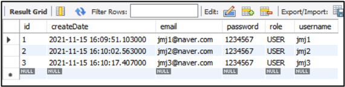
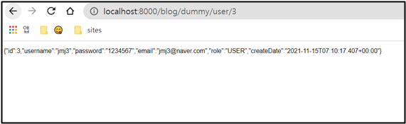

# select 테스트 (with. id)

먼저 앞에서 삽입했던 데이터를 지우기 위해서 테이블을 지워야 한다.  yaml 가서 테이블 ddl을 create로 바꾸고 다시 실행한다. 그다음 데이터를 몇 개 삽입한다. 

<br>



데이터 잘 삽입된 것을 알 수 있다. 그리고 ddl 다시 update로 바꿔준다. 

<br><br>

## ✅ select 코드 추가 

### ⚫ 방법1

```java
package com.cos.blog.test;

import java.util.function.Supplier;

import org.springframework.beans.factory.annotation.Autowired;
import org.springframework.web.bind.annotation.GetMapping;
import org.springframework.web.bind.annotation.PathVariable;
import org.springframework.web.bind.annotation.PostMapping;
import org.springframework.web.bind.annotation.RestController;

import com.cos.blog.model.RoleType;
import com.cos.blog.model.User;
import com.cos.blog.repository.UserRepository;

@RestController
public class DummyControllerTest {
    
	@Autowired 
	private UserRepository userRepository;
	
	// <select 테스트>
	// {id}주소로 파라미터를 전달 받을 수 있다.
	// http://localhost:8000/blog/dummy/user/3
	// 위의 주소를 요청하면 3이 {id}에 쏙 들어간다.
	@GetMapping("dummy/user/{id}")
	public User detail(@PathVariable int id) {
		
		// findById의 리턴 타입이 User가 아니라 Optional이다. 
		// 만약에 user/4 를 찾을 때, 데이터베이스에서 못찾아오면 user가 null이 된다.
		// 그럼 return 할 때 null이 return된다. 그럼 프로그램에 문제가 생길수도...
		// 그래서 Optional로 User 객체를 감싸서 가져올테니 null인지 아닌지 판단해서 return 하는 것이다!!
		User user = userRepository.findById(id).orElseGet(new Supplier<User>() { // 익명 객체
			// Supplier는 인터페이스니까, 인터페이스가 들고있는 함수 get을 override 해주어야 한다. get()은 추상메소드니까
			// 인터페이스 new 하려면 익명 객체를 만들어야 한다. 
			
			// 없는 id의 값이 요청이 되면 get()이 실행돼서 빈 객체를 user에 넣어줌
			// 그러면 null은 아니니까.. 
			@Override
			public User get() {
				return new User();
			}
		});		
		return user;
	}
	
	@PostMapping("/dummy/join")
	public  String join(User user) { 
		System.out.println("username : " + user.getUsername());
		System.out.println("password : " + user.getPassword());
		System.out.println("email : " + user.getEmail());
		
		System.out.println("id : " + user.getId());
		System.out.println("role : " + user.getRole());
		System.out.println("createDate : " + user.getCreateDate());
		
		user.setRole(RoleType.USER);
		userRepository.save(user);
		
		return "회원가입이 완료되었습니다.";
	}
}
```

이 방법 말고 아래 방법 사용하기

<br>

### ⚫ 방법2

```java
package com.cos.blog.test;

import java.util.function.Supplier;

import org.springframework.beans.factory.annotation.Autowired;
import org.springframework.web.bind.annotation.GetMapping;
import org.springframework.web.bind.annotation.PathVariable;
import org.springframework.web.bind.annotation.PostMapping;
import org.springframework.web.bind.annotation.RestController;

import com.cos.blog.model.RoleType;
import com.cos.blog.model.User;
import com.cos.blog.repository.UserRepository;

@RestController
public class DummyControllerTest {
	
	@Autowired 
	private UserRepository userRepository;

	@GetMapping("dummy/user/{id}")
	public User detail(@PathVariable int id) {

		User user = userRepository.findById(id).orElseThrow(new Supplier<IllegalArgumentException>()) {
			@Override
			public IllegalArgumentException get() {
				return new IllegalArgumentException("해당 유저는 없습니다! id : " + id);
			}
		});

		// 요청은 웹브라우저에서 하는데
		// 웹브라우저는 user 객체를 이해못함 -> user 객체를 변환해야함 -> 웹브라우저가 이해할수 있는 데이터로! 
		// 가장 좋은 방법은 JSON임
		// 스프링 부트는 MessageConverter라는 애가 응답시에 자동 작동한다
		// 만약에 자바 오브젝트를 리턴하게 되면 MessageConverter가 Jackson 이라는 라이브러리를 호출해서
		// user 오브젝트를 json으로 변환해서 브라우저에게 던져준다. 
		return user;
	}
	
	@PostMapping("/dummy/join")
	public  String join(User user) { 
		System.out.println("username : " + user.getUsername());
		System.out.println("password : " + user.getPassword());
		System.out.println("email : " + user.getEmail());
		
		// Postman에서 null 값 들어옴
		System.out.println("id : " + user.getId());
		System.out.println("role : " + user.getRole());
		System.out.println("createDate : " + user.getCreateDate());
		
		user.setRole(RoleType.USER);
		userRepository.save(user);
		
		return "회원가입이 완료되었습니다.";
	}
}
```

<br>

### ⚫ 결과



잘 나온다.
