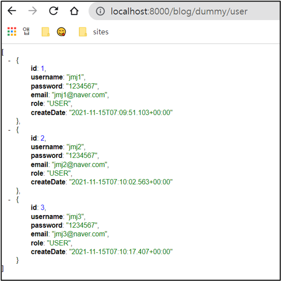

# select 테스트 - 여러 건의 데이터 

## ⚫ DummyControllerTest 수정

```java
	@GetMapping("/dummy/user")
	public List<User> list(){
		return userRepository.findAll(); 
	}
```

list() 함수를 추가해준다.

<br>

```java
package com.cos.blog.test;

import java.util.List;
import java.util.function.Supplier;

import org.springframework.beans.factory.annotation.Autowired;
import org.springframework.web.bind.annotation.GetMapping;
import org.springframework.web.bind.annotation.PathVariable;
import org.springframework.web.bind.annotation.PostMapping;
import org.springframework.web.bind.annotation.RestController;

import com.cos.blog.model.RoleType;
import com.cos.blog.model.User;
import com.cos.blog.repository.UserRepository;

@RestController
public class DummyControllerTest {
	@Autowired 
	private UserRepository userRepository;
	
	// 여러 건의 데이터 불러오기
	// http://localhost:8000/blog/dummy/user
	@GetMapping("/dummy/user")
	public List<User> list(){
		return userRepository.findAll(); // 전체가 다 리턴됨
	}

	@GetMapping("dummy/user/{id}")
	public User detail(@PathVariable int id) {
		
		// http://localhost:8000/blog/dummy/user/3
		User user = userRepository.findById(id).orElseThrow(new Supplier<IllegalArgumentException>() {
			@Override
			public IllegalArgumentException get() {
				return new IllegalArgumentException("해당 유저는 없습니다! id : " + id);
			}
		});
		return user;
	}
	
	@PostMapping("/dummy/join")
	public  String join(User user) { 
		System.out.println("username : " + user.getUsername());
		System.out.println("password : " + user.getPassword());
		System.out.println("email : " + user.getEmail());
		
		// Postman에서 null 값 들어옴
		System.out.println("id : " + user.getId());
		System.out.println("role : " + user.getRole());
		System.out.println("createDate : " + user.getCreateDate());
		
		user.setRole(RoleType.USER);
		userRepository.save(user);
		
		return "회원가입이 완료되었습니다.";
	}
}

```

<br>

### ⚫ 결과



전체 데이터가 잘 불러온다.

