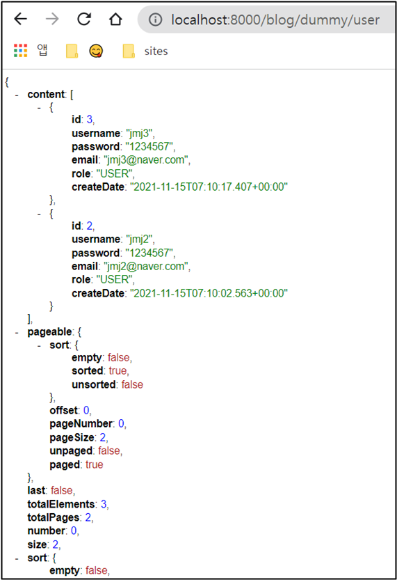
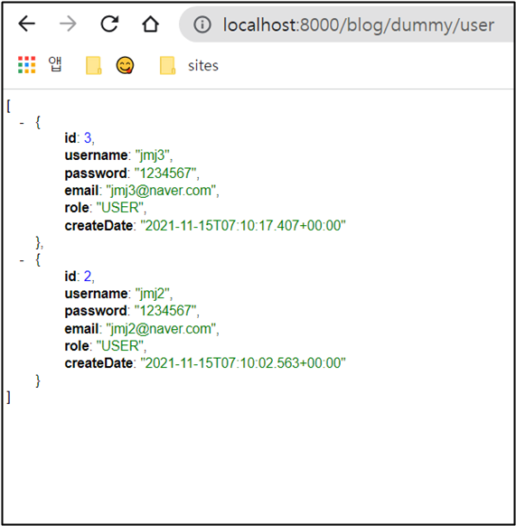

# 페이징

## ✅ 코드 추가

```java
@GetMapping("/dummy/user")/	public Page<User> pageList(@PageableDefault(size=2, sort="id", direction = Direction.DESC) Pageable pageable){
		Page<User> users = userRepository.findAll(pageable);
		return users;
	}
```

다음 코드를 추가한다.

<br>

```java
package com.cos.blog.test;

import java.util.List;
import java.util.function.Supplier;

import org.springframework.beans.factory.annotation.Autowired;
import org.springframework.data.domain.Page;
import org.springframework.data.domain.Pageable;
import org.springframework.data.domain.Sort.Direction;
import org.springframework.data.web.PageableDefault;
import org.springframework.web.bind.annotation.GetMapping;
import org.springframework.web.bind.annotation.PathVariable;
import org.springframework.web.bind.annotation.PostMapping;
import org.springframework.web.bind.annotation.RestController;

import com.cos.blog.model.RoleType;
import com.cos.blog.model.User;
import com.cos.blog.repository.UserRepository;

@RestController
public class DummyControllerTest {

	@Autowired 
	private UserRepository userRepository;
    
	@GetMapping("/dummy/users") // 페이징 테스트 하면서 /dummy/user 에서 /dummy/users로 바꿈
	public List<User> list(){
		return userRepository.findAll(); 
	}
	
	// 페이징
	// 한페이지당 2건의 데이터를 리턴받기 테스트
	// JSP 같은 것은 페이징 할라면 개발자가 로직을 다 짜야하는데
	// JPA는 페이징하는 강력한 기능을 제공함 
	// http://localhost:8000/blog/dummy/user
	@GetMapping("/dummy/user")/	public Page<User> pageList(@PageableDefault(size=2, sort="id", direction = Direction.DESC) Pageable pageable){
		 2건씩, id로, DESC : id를  최신순으로 들고온다.
		Page<User> users = userRepository.findAll(pageable);
		return users;
	}
	// 어렵다...ㅡㅡ
    
	@GetMapping("dummy/user/{id}")
	public User detail(@PathVariable int id) {
        
		User user = userRepository.findById(id).orElseThrow(new Supplier<IllegalArgumentException>() {
			@Override
			public IllegalArgumentException get() {
				return new IllegalArgumentException("해당 유저는 없습니다! id : " + id);
			}
		});	
		return user;
	}
	
	@PostMapping("/dummy/join")
	public  String join(User user) { 
		System.out.println("username : " + user.getUsername());
		System.out.println("password : " + user.getPassword());
		System.out.println("email : " + user.getEmail());
		
		// Postman에서 null 값 들어옴
		System.out.println("id : " + user.getId());
		System.out.println("role : " + user.getRole());
		System.out.println("createDate : " + user.getCreateDate());
		
		user.setRole(RoleType.USER);
		userRepository.save(user);
		
		return "회원가입이 완료되었습니다.";
	}
}
```

<br>

### ⚫ 결과



http://localhost:8000/blog/dummy/user?page=0 👉 첫번째 페이지

http://localhost:8000/blog/dummy/user?page=1 👉 두번째 페이지

<br><br>

## ✅ content만 불러오기

위의 결과 화면을 보면 밑에 잡다한 것도 같이 불러오는 것을 볼 수 있다. 저것을 없애보자.

<br>

### ⚫ 코드 수정

```java
package com.cos.blog.test;

import java.util.List;
import java.util.function.Supplier;

import org.springframework.beans.factory.annotation.Autowired;
import org.springframework.data.domain.Page;
import org.springframework.data.domain.Pageable;
import org.springframework.data.domain.Sort.Direction;
import org.springframework.data.web.PageableDefault;
import org.springframework.web.bind.annotation.GetMapping;
import org.springframework.web.bind.annotation.PathVariable;
import org.springframework.web.bind.annotation.PostMapping;
import org.springframework.web.bind.annotation.RestController;

import com.cos.blog.model.RoleType;
import com.cos.blog.model.User;
import com.cos.blog.repository.UserRepository;

@RestController
public class DummyControllerTest {
	@Autowired // 의존성 주입(DI)
	private UserRepository userRepository;
	
	@GetMapping("/dummy/users") 
	public List<User> list(){
		return userRepository.findAll();
	}
    
    // 수정
	@GetMapping("/dummy/user")
	public List<User> pageList(@PageableDefault(size=2, sort="id", direction = Direction.DESC) Pageable pageable){
		// 2건씩, id로, DESC : id를  최신순으로 들고온다.
		List<User> users = userRepository.findAll(pageable).getContent();
		return users;
	}
	
	@GetMapping("dummy/user/{id}")
	public User detail(@PathVariable int id) {
		User user = userRepository.findById(id).orElseThrow(new Supplier<IllegalArgumentException>() {
			@Override
			public IllegalArgumentException get() {
				return new IllegalArgumentException("해당 유저는 없습니다! id : " + id);
			}
		});
		return user;
	}
	
	@PostMapping("/dummy/join")
	public  String join(User user) { 
		System.out.println("username : " + user.getUsername());
		System.out.println("password : " + user.getPassword());
		System.out.println("email : " + user.getEmail());
		
		System.out.println("id : " + user.getId());
		System.out.println("role : " + user.getRole());
		System.out.println("createDate : " + user.getCreateDate());
		
		user.setRole(RoleType.USER);
		userRepository.save(user);
		
		return "회원가입이 완료되었습니다.";
	}
}
```

<br>

### ⚫ 결과



깔끔하게 필요한 것만 나온 것을 볼 수 있다.