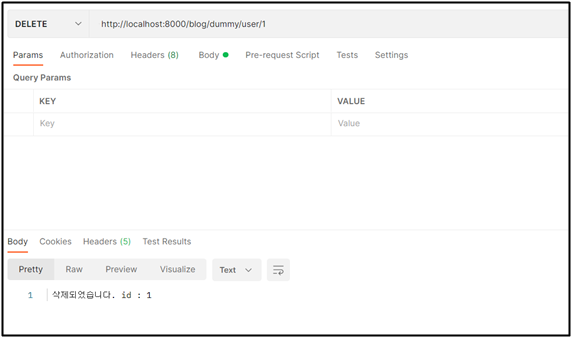
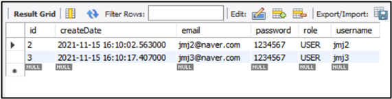

# delete 테스트

- delete를 만들고 user1을 삭제해보자

<br>

## ✅ delete 

```java
package com.cos.blog.test;

import java.util.List;
import java.util.function.Supplier;

import org.springframework.beans.factory.annotation.Autowired;
import org.springframework.dao.EmptyResultDataAccessException;
import org.springframework.data.domain.Page;
import org.springframework.data.domain.Pageable;
import org.springframework.data.domain.Sort.Direction;
import org.springframework.data.web.PageableDefault;
import org.springframework.web.bind.annotation.DeleteMapping;
import org.springframework.web.bind.annotation.GetMapping;
import org.springframework.web.bind.annotation.PathVariable;
import org.springframework.web.bind.annotation.PostMapping;
import org.springframework.web.bind.annotation.RestController;

import com.cos.blog.model.RoleType;
import com.cos.blog.model.User;
import com.cos.blog.repository.UserRepository;

@RestController
public class DummyControllerTest {
	@Autowired 
	private UserRepository userRepository;
	
	// http://localhost:8000/blog/dummy/user/1 -> user1을 삭제해보자 
	@DeleteMapping("/dummy/user/{id}")
	public String delete(@PathVariable int id) {
		try {
			userRepository.deleteById(id);
		}catch(EmptyResultDataAccessException e) {
			return "삭제에 실패하였습니다. 해당 id는 DB에 없습니다.";
		}
		return " 삭제되었습니다. id : " + id;
	}
}
```

<br>

### 결과



<br>

