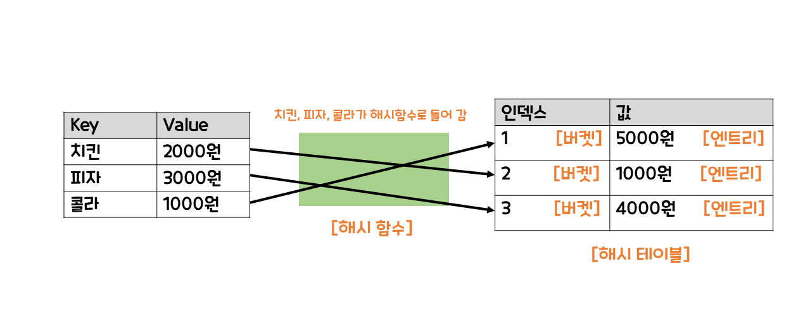

# 해시

## ✅ 해시란?

Key와 Value로 데이터를 관리 및 유지하는 자료구조이다. Key를 통해서 원하는 Value를 바로 찾을 수 있으므로 속도가 빠르고 시간복잡도는 O(1) 이다. 

 

## ✅ 동작 방식

 Key가 해시 함수에 들어가면 해시 코드가 나온다. 그 해시코드가 인덱스가 된다. 그리고 해당 인덱스에 Value가 저장된다. 이 과정을 해싱이라고 한다. 

위 사진을 보자. 피자가 얼마인지 궁금하면 피자를 해시 함수에 넣으면 된다. 그러면 해시 함수는 인덱스 1을 알려주고 테이블의 인덱스 1에 가서 피자의 가격이 5000원인 것을 바로 알 수 있다.

  

## ✅ 해시의 문제점

여러 Key에 대해서 해시 함수가 같은 해시코드를 만들어 주었을 때 해시 충돌이 발생한다.

 

## ✅ 해결

체이닝(Chaining) 방법이 있다. 해시 충돌이 발생하면 데이터들을 연결리스트로 연결하고 해시테이블 안에서 선형검색을 한다. 
