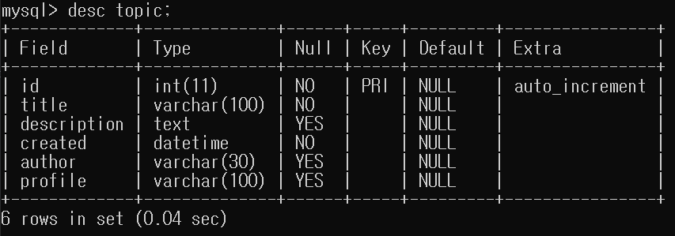
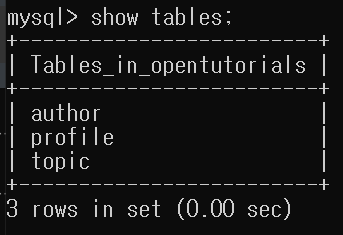
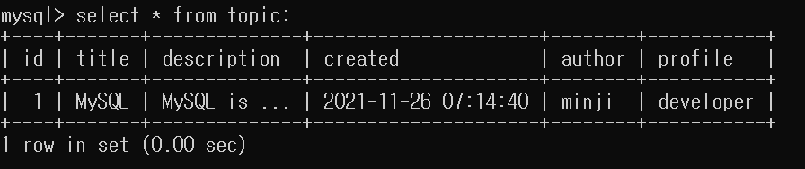
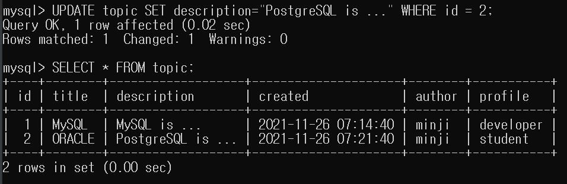
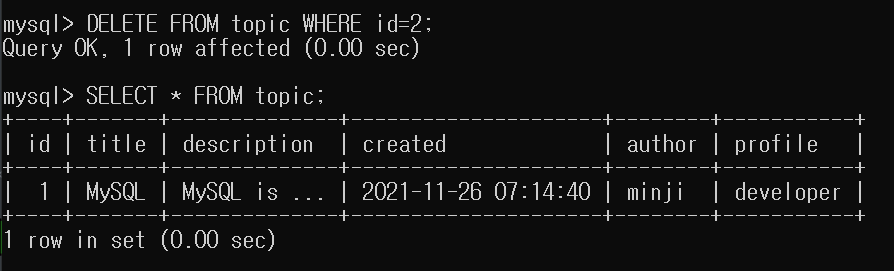

# SQL

- SQL 이란?
- SQL 사용
- SQL  CRUD

<br>

## ✅ SQL (Structured Query Language)  

SQL은 MySQL Server에게 소통하는 언어이다.

<br>

## ✅ SQL 사용

### 테이블 생성

```mysql
CREATE TABLE topic(
    id INT(11) NOT NULL AUTO_INCREMENT,
    title VARCHAR(100) NOT NULL,
    description TEXT NULL,
    created DATETIME NOT NULL,
    author VARCHAR(30) NULL,
    profile VARCHAR(100) NULL,
    PRIMARY KEY(id));
```

id INT(11) 👉  숫자 검색 같은 것 할 때 얼마까지만 노출할 것이냐를 정하는 것  

<br>

### 테이블 정보 보기

```mysql
desc [테이블 이름];
```

```mysql
desc topic;
```



<br>

### 사용 중인 데이터베이스의 테이블 목록 보기

```mysql
show tables;
```



<br>

## ✅ CRUD

### CREATE

```mysql
INSERT INTO table_name (column1, column2, column3, ...)
VALUES (value1, value2, value3, ...);
```

```mysql
INSERT INTO topic (title, description, created, author, profile) 
VALUES ("MySQL", "MySQL is ...", NOW(), "minji", "developer");
```

<br>

### READ

```mysql
SELECT column1, column2, ... FROM table_name;
```

```mysql
select * from topic;
```

<br>



<br>

### UPDATE

```mysql
UPDATE table_name
SET column1 = value1, column2 = value2, ...
WHERE condition;
```

```mysql
UPDATE topic SET description="PostgreSQL is ..." WHERE id = 2;
```

<br>




<br>

### DELETE

```mysql
DELETE FROM table_name WHERE condition;
```

```mysql
DELETE FROM topic WHERE id=2;
```

<br>



