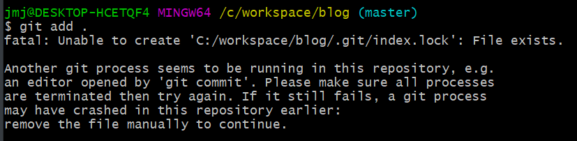

# 오류

## ✅ 오류 



```shell
git add .
```

위의 명령문을 입력하니까 아래와 같은 오류가 나왔다. 

<br>

```shell
fatal: Unable to create 'C:/workspace/blog/.git/index.lock': File exists.
```

<br>

## ✅ 해결 

```shell
rm -f ./.git/index.lock
```

위와 같은 명령어를 입력 후 다시 하면 된다.