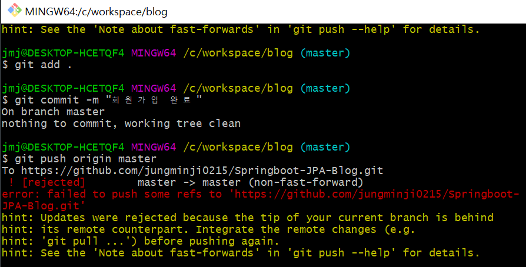

# git push 오류

## ✅ 오류 화면



Springboot 프로젝트 수정사항 push 하는데 갑자기 오류가 나서 안 된다. 검색해보니 깃허브에서 README.md 파일을 생성해서 난 오류 같았다. 정확한 건 아니다 😂

<br>

## ✅ 해결

```bash
To https://github.com/jungminji0215/Springboot-JPA-Blog.git
 ! [rejected]        master -> master (non-fast-forward)
error: failed to push some refs to 'https://github.com/jungminji0215/Springboot-JPA-Blog.git'
hint: Updates were rejected because the tip of your current branch is behind
hint: its remote counterpart. Integrate the remote changes (e.g.
hint: 'git pull ...') before pushing again.
hint: See the 'Note about fast-forwards' in 'git push --help' for details.

```

오류 난 메시지들을 검색하면서 해결하였다. 

<br>

```bash
git remote add origin [//your github url]

//pull those changes

git pull origin master 

// or optionally, 'git pull origin master --allow-unrelated-histories' if you have initialized repo in github and also committed locally

//now, push your work to your new repo

git push origin master
```

[링크](https://stackoverflow.com/questions/18328800/github-updates-were-rejected-because-the-remote-contains-work-that-you-do-not-h) 👈 이 링크에서 알려준 방법을 따라 하니까 해결할 수 있었다.

