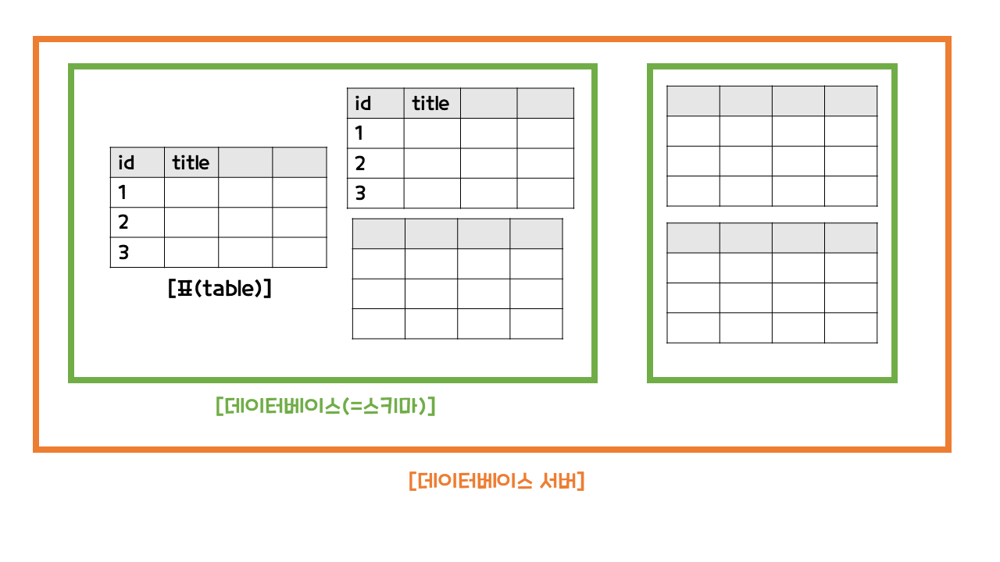
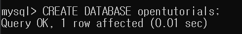

# MySQL

- MySQL 이란?
- 서버 접속
- 데이터베이스 생성
- 표 생성

<br>

## ✅ MySQL 이란?

MySQL은 관계형 데이터베이스를 관리하는 시스템이다.

⭐ RDBMS (Relational Database Management System)

<br>



관계형 데이터베이스는 정보가 표(table)에 저장이 된다. 데이터베이스(database)는 스키마(schema)라고도 부르며, 연관된 표들을 그루핑해서 연관되어 있지 않은 표들과 분리해준다. 그리고 여러 개의 데이터베이스가 모여서 데이터베이스 서버라고 한다. 

MySQL 설치한 것을 데이터베이스 서버를 설치한 것과 같다.

<br>

## ✅ 서버 접속

MySQL을 사용하려면 MySQL 서버에 접속하는 것을 제일 먼저 해야 한다.

<br>

```shell
mysql -uroot -p
```

위의 방법으로 MySQL 서버에 접속한다.

- -u[사용자] : root 사용자는 모든 권한이 있다.

<br>

## ✅ 데이터베이스 생성 (스키마 생성)

### 방법

```shell
CREATE DATABASE [데이터베이스 이름];
```

<br>

### 예시

```shell
 CREATE DATABASE opentutorials;
```



<br>

## ✅ 데이터베이스 사용 

데이터베이스를 사용하려면 MySQL에 사용하겠다고 알려줘야 한다.

```
USE opentutorials;
```

위의 명령문을 실행하면 MySQL은 지금부터 내가 쓰는 명령문을 opentutorials라는 스키마에 있는 표를 대상으로 명령을 실행하게 된다.

<br>

 ## ✅ 기타

### 데이터베이스 확인

```shell
SHOW DATABASES;
```


<br>

### 데이터베이스 삭제

```shell
DROP DATABASE [데이터베이스 이름];
```

<br>

```shell
DROP DATABASE opentutorials;
```


